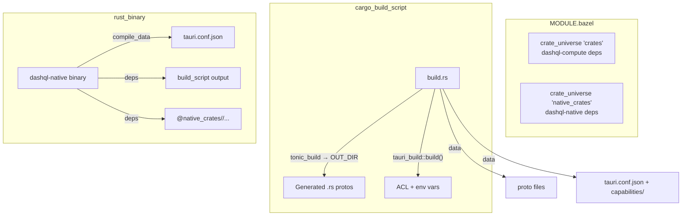

# Integrate dashql-native into Bazel (sandbox-compatible)

## Current state

- `dashql-native` is a Rust/Tauri 2 desktop app built via Cargo (`cargo/native/Cargo.toml` workspace)
- It has a minimal [BUILD.bazel](packages/dashql-native/BUILD.bazel) that only exports a `filegroup` for metadata
- A separate Cargo workspace (`cargo/native/`) holds `dashql-native` and `dashql-pack`, with its own `Cargo.lock`
- The existing `crate_universe` in [MODULE.bazel](MODULE.bazel) only covers `dashql-compute` (root workspace)
- `dashql-compute` uses `tags = ["no-sandbox"]` on its `cargo_build_script` -- we will NOT do that here

## Key challenges

1. **Separate dependency universe** -- native workspace deps (Tauri, tokio with rt, hyper, tonic, etc.) differ entirely from the compute workspace (DataFusion, wasm-bindgen). Need a second `crate_universe`.
2. **Proto generation in sandbox** -- `build.rs` uses `tonic_build` with hardcoded relative paths (`../../proto/pb/...`) and writes to `src/proto/`. Must switch to `OUT_DIR` + env-var-driven paths.
3. **Tauri build script in sandbox** -- `tauri_build::build()` reads `tauri.conf.json` and `capabilities/main.json` relative to `CARGO_MANIFEST_DIR`. Must provide these via `data` so they exist in the sandbox.
4. **Tauri proc macro at compile time** -- `tauri::generate_context!()` reads config; build script sets `TAURI_CONFIG` via `cargo:rustc-env`, which rules_rust forwards to compilation. Include `tauri.conf.json` in `compile_data` as a safety net.

## Architecture




## Changes

### 1. `MODULE.bazel` -- add native crate_universe

Add a second `crate.from_cargo` block after the existing compute one:

```python
native_crate = use_extension("@rules_rust//crate_universe:extensions.bzl", "crate")
native_crate.from_cargo(
    name = "native_crates",
    cargo_lockfile = "//cargo/native:Cargo.lock",
    manifests = [
        "//cargo/native:Cargo.toml",
        "//packages/dashql-native:Cargo.toml",
        "//packages/dashql-pack:Cargo.toml",
    ],
    supported_platform_triples = [
        "aarch64-apple-darwin",
        "x86_64-unknown-linux-gnu",
    ],
)
use_repo(native_crate, "native_crates")
```

### 2. `proto/pb/BUILD.bazel` -- add filegroup for native protos

Add a filegroup exposing the proto files dashql-native needs:

```python
filegroup(
    name = "native_proto_srcs",
    srcs = [
        "salesforce/hyperdb/grpc/v1/hyper_service.proto",
        "dashql/test/test_service.proto",
    ],
)
```

### 3. `packages/dashql-native/build.rs` -- sandbox-compatible

Modify to:

- Write tonic_build output to `OUT_DIR` (standard Rust approach, works in both Cargo and Bazel)
- Accept proto file paths via env vars (`PROTO_HYPER_SERVICE`, `PROTO_TEST_SERVICE`) for Bazel
- Fall back to relative paths for plain Cargo builds

```rust
fn main() -> Result<(), Box<dyn std::error::Error>> {
    let out_dir = std::env::var("OUT_DIR").expect("OUT_DIR");

    let (proto_files, include_dirs) = if let Ok(hyper_proto) = std::env::var("PROTO_HYPER_SERVICE") {
        let test_proto = std::env::var("PROTO_TEST_SERVICE").expect("PROTO_TEST_SERVICE");
        let include = std::env::var("PROTO_INCLUDE").unwrap_or_else(|_| ".".into());
        (vec![hyper_proto, test_proto], vec![include])
    } else {
        println!("cargo:rerun-if-changed=../../proto/pb/salesforce/hyperdb/grpc/v1/hyper_service.proto");
        println!("cargo:rerun-if-changed=../../proto/pb/dashql/test/test_service.proto");
        (
            vec![
                "../../proto/pb/salesforce/hyperdb/grpc/v1/hyper_service.proto".into(),
                "../../proto/pb/dashql/test/test_service.proto".into(),
            ],
            vec!["../../proto/pb/".into()],
        )
    };

    tonic_build::configure()
        .out_dir(&out_dir)
        .compile(&proto_files, &include_dirs)?;
    tauri_build::build();
    Ok(())
}
```

### 4. `packages/dashql-native/src/proto/mod.rs` -- include from OUT_DIR

Replace `#[path = "..."]` with `tonic::include_proto!()`, the standard approach:

```rust
pub mod salesforce_hyperdb_grpc_v1 {
    tonic::include_proto!("salesforce.hyperdb.grpc.v1");
}
pub mod dashql_test {
    tonic::include_proto!("dashql.test");
}
```

### 5. `packages/dashql-native/BUILD.bazel` -- full Bazel targets

```python
load("@rules_rust//cargo:defs.bzl", "cargo_build_script")
load("@rules_rust//rust:defs.bzl", "rust_binary", "rust_test")

cargo_build_script(
    name = "build_script",
    srcs = ["build.rs"],
    pkg_name = "dashql-native",
    data = [
        "tauri.conf.json",
        "capabilities/main.json",
        "//proto/pb:native_proto_srcs",
        "//proto/pb:salesforce/hyperdb/grpc/v1/hyper_service.proto",
        "//proto/pb:dashql/test/test_service.proto",
    ],
    build_script_env = {
        "PROTO_HYPER_SERVICE": "$(execpath //proto/pb:salesforce/hyperdb/grpc/v1/hyper_service.proto)",
        "PROTO_TEST_SERVICE": "$(execpath //proto/pb:dashql/test/test_service.proto)",
    },
    deps = [
        "@native_crates//:tauri-build",
        "@native_crates//:tonic-build",
    ],
    rundir = "packages/dashql-native",
)

NATIVE_DEPS = [
    ":build_script",
    "@native_crates//:tauri",
    "@native_crates//:tauri-plugin-os",
    "@native_crates//:tauri-plugin-deep-link",
    "@native_crates//:tauri-plugin-shell",
    "@native_crates//:tauri-plugin-http",
    "@native_crates//:tauri-plugin-process",
    "@native_crates//:tauri-plugin-dialog",
    "@native_crates//:tauri-plugin-fs",
    "@native_crates//:tauri-plugin-log",
    "@native_crates//:tauri-plugin-updater",
    "@native_crates//:tauri-plugin",
    "@native_crates//:hyper",
    "@native_crates//:hyper-util",
    "@native_crates//:http-body-util",
    "@native_crates//:http",
    "@native_crates//:tower-service",
    "@native_crates//:reqwest",
    "@native_crates//:tonic",
    "@native_crates//:prost",
    "@native_crates//:tokio",
    "@native_crates//:tokio-stream",
    "@native_crates//:serde",
    "@native_crates//:serde_json",
    "@native_crates//:anyhow",
    "@native_crates//:bytes",
    "@native_crates//:byteorder",
    "@native_crates//:url",
    "@native_crates//:once_cell",
    "@native_crates//:lazy_static",
    "@native_crates//:env_logger",
    "@native_crates//:log",
    "@native_crates//:regex-automata",
    "@native_crates//:mime",
    "@native_crates//:futures-util",
    "@native_crates//:futures-core",
]

rust_binary(
    name = "dashql-native",
    srcs = glob(["src/**/*.rs"]),
    crate_root = "src/main.rs",
    compile_data = [
        "tauri.conf.json",
        "capabilities/main.json",
    ],
    deps = NATIVE_DEPS,
)

rust_test(
    name = "tests",
    crate = ":dashql-native",
    compile_data = [
        "tauri.conf.json",
        "capabilities/main.json",
    ],
    visibility = ["//visibility:public"],
)
```

### 6. Repin native crates

After the MODULE.bazel changes:

```bash
CARGO_BAZEL_REPIN=1 bazel sync --only=native_crates
```

## Risks and mitigations

- `**tauri_build::build()` file discovery**: It reads `tauri.conf.json` and `capabilities/` via `CARGO_MANIFEST_DIR`. The `rundir` + `data` combo should place files correctly, but if `CARGO_MANIFEST_DIR` doesn't match, we may need `build_script_env` to override it.
- `**tauri::generate_context!()` at compile time**: The build script sets `TAURI_CONFIG` via `cargo:rustc-env`, which rules_rust forwards. `compile_data` with `tauri.conf.json` is a fallback.
- **Crate name mismatches in `native_crates`**: Tauri plugin crates use names like `tauri-plugin-os`; crate_universe may normalize these to `tauri_plugin_os`. We'll need to verify the exact label names after repinning. Run `bazel query '@native_crates//...'` to inspect.
- `**frontendDist` path in `tauri.conf.json**`: Points to `../dashql-app/build/reloc`. Not needed for building the binary, but if `tauri_build` validates it, we may need a stub or a Bazel-specific config.

