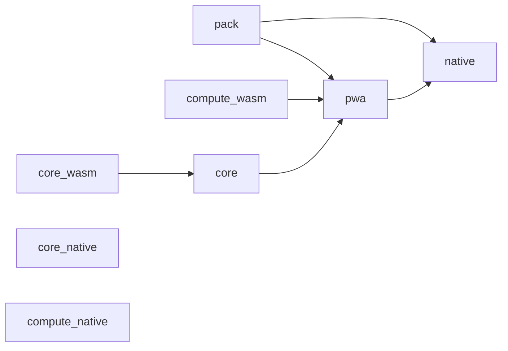
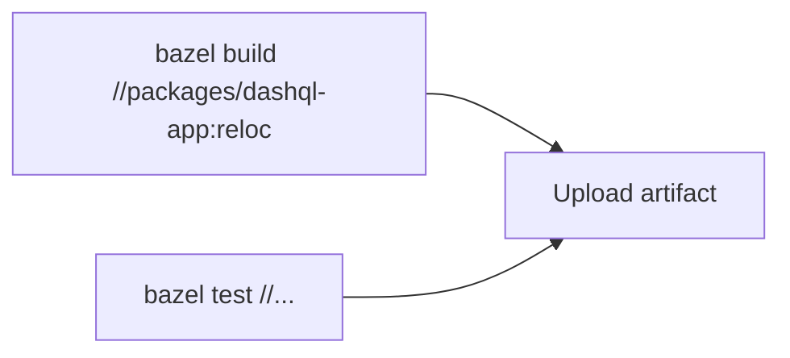

# Migrate GitHub CI to Bazel

## Why this is simpler with Bazel

The current [build.yml](.github/workflows/build.yml) uses 7 GitHub Actions jobs to manually parallelize the build and pass artifacts between them:




Bazel already models this entire dependency graph internally via `//packages/dashql-app:reloc`. A single `bazel build` command will build everything with automatic parallelism. No artifact passing needed.




## Key files to change

### 1. Add CI config to `.bazelrc`

Current [.bazelrc](.bazelrc) is minimal (1 line). Add a `--config=ci` section:

```
build:ci --disk_cache=
build:ci --repository_cache=~/.cache/bazel-repo
build:ci --jobs=auto
build:ci --verbose_failures
test:ci --test_output=errors
```

Disk cache is intentionally empty (disabled) because `bazel-contrib/setup-bazel` manages the cache externally via GHA cache. The repo cache speeds up fetches.

### 2. Rewrite `build.yml` to a single Bazel job

Replace the entire 7-job workflow with:

- **Single `build` job** on `ubuntu-24.04`:
  1. Checkout with submodules + full history (for `git describe` version stamping)
  2. Set up Bazel via `bazel-contrib/setup-bazel@0.14.0` with disk cache + repository cache
  3. `bazel build //packages/dashql-app:reloc --config=ci` -- builds everything (C++ WASM, Rust WASM, protos, flatbuffers, SVG symbols, Vite app)
  4. `bazel test //... --config=ci` -- runs all tests (C++ snapshot tests, unit tests, vitest, rust tests)
  5. Upload the `reloc` output as an artifact

The `signed` input and all macOS/native-related logic is removed.
The `commit` input is kept for checkout ref.

The `bazel-contrib/setup-bazel` action handles:

- Installing Bazel (via Bazelisk)
- Caching the disk cache, repository cache, and external dependencies via GHA cache
- Restoring/saving caches across runs

### 3. Update caller workflows

All callers pass `signed: true/false` and reference artifacts that no longer exist. Update:

- [push_main.yml](.github/workflows/push_main.yml): Remove `signed: true`, keep build -> publish chain
- [push_other.yml](.github/workflows/push_other.yml): Remove `signed: false`, drop coverage job (coverage artifacts no longer produced)
- [pull_request.yml](.github/workflows/pull_request.yml): Remove `signed: false`
- [push_tag.yml](.github/workflows/push_tag.yml): Remove `signed: true`, keep build -> publish chain

### 4. Update `publish.yml`

The current [publish.yml](.github/workflows/publish.yml) has two jobs:

- `pages`: Downloads `dashql_pwa_pages` and deploys to GitHub Pages
- `native`: Downloads native macOS artifacts and publishes to R2

Changes:

- `pages` job: Update to download the `reloc` artifact (or add a `pages` Bazel target if a different base URL is needed)
- `native` job: Remove entirely (dropping native build)

### 5. Delete custom setup actions

The following [.github/actions/](.github/actions/) are no longer needed since Bazel manages all toolchains (WASI SDK, FlatBuffers, Binaryen, WABT, etc.):

- `setup-binaryen` -- handled by `@binaryen` in `core_dependencies.bzl`
- `setup-flatc` -- handled by `@flatbuffers` in `core_dependencies.bzl`
- `setup-wabt` -- handled by `@wabt` in `core_dependencies.bzl`
- `setup-wasi-sdk` -- handled by `@wasi_sdk` in `core_dependencies.bzl`
- `setup-llvm` -- no longer needed (native C++ build is via Bazel's CC toolchain)
- `setup-protoc` -- handled by `@rules_proto` / protoc in MODULE.bazel
- `setup-rust` -- handled by `@rules_rust` in MODULE.bazel
- `setup-tauri` -- not needed (dropping native build)

### 6. Open question: `pages` variant

The old workflow builds two PWA variants: `reloc` (relocatable base URL) and `pages` (absolute base for GitHub Pages). The Bazel [BUILD.bazel](packages/dashql-app/BUILD.bazel) only has `:reloc`. If `push_main` / `push_tag` still need to deploy to GitHub Pages with a different base URL, a `:pages` target should be added to `packages/dashql-app/BUILD.bazel` (identical to `:reloc` but with a different vite config that sets `base: "/"`).
