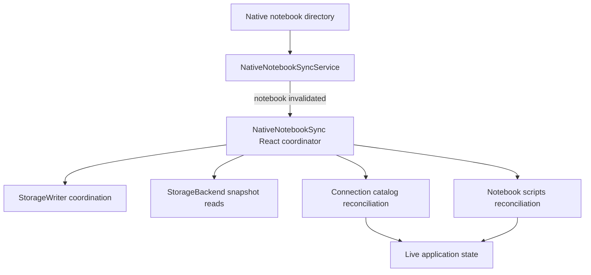
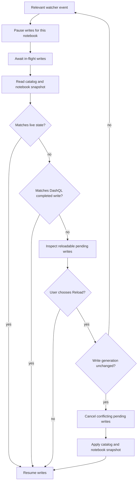

# Native File Synchronization

DashQL native notebooks live in user-owned directories. DashQL writes scripts and catalog changes to
those directories through a debounced `StorageWriter`; users and external tools may also edit the
same files. Native file synchronization detects those external changes and offers to reload them into
the running application without reopening the notebook.

This feature is intentionally narrow. Filesystem watching, conflict handling, and reload coordination
are contained behind one native synchronization boundary. Storage backends remain request/response
readers and writers, while connection and notebook state retain ownership of their domain-specific
WASM and catalog lifecycles.

## Goals

- Detect externally changed native scripts and catalog files.
- Reload added, removed, renamed, and edited scripts.
- Preserve active connection state, query history, focus, and script identity where possible.
- Prevent delayed events from DashQL's own writes from appearing as external changes.
- Avoid silently discarding local debounced edits.
- Keep native watcher concepts out of generic storage backends and notebook reducers.
- Behave consistently across macOS, Linux, and Windows path formats.

## Non-Goals

- Synchronizing OPFS notebooks. Browser-private storage has no supported external editor workflow.
- Watching or reloading `dashql-notebook.json`. Connection identity and parameters require a complete
  connection lifecycle and are not safe to replace in place.
- Watching query cache files, `.gitignore`, or other generated and unrelated files.
- Automatic text merging. A conflict is resolved by keeping the current application state or loading
  the complete external snapshot.
- Treating filesystem events as a reliable change log. Events are only invalidation signals.
- Coordinating simultaneous DashQL processes editing the same native directory as a distributed
  transactional system.

## Persisted Layout

The synchronization boundary recognizes these notebook-relative paths:

```text
dashql-relations.sql
dashql-functions.sql
scripts/
  dashql-draft.sql
  <page>/
    <script>.sql
```

It deliberately ignores:

```text
dashql-notebook.json
cache/
.gitignore
<any other file>
```

The native notebook directory is resolved through `StorageReader.getNotebookLocation`. Only locations
with `StorageBackendType.Native` and a `nativePath` receive a watcher.

## Architecture



### Watch Service

`NativeNotebookSyncService` in
`packages/dashql-app/src/platform/storage/native_notebook_sync.ts` is the platform adapter. It:

- Creates recursive watchers through `@tauri-apps/plugin-fs`.
- Reconciles the desired notebook-to-directory set with currently active watchers.
- Debounces native events by 200 ms.
- Normalizes Windows separators before matching relative paths.
- Ignores access-only events and paths outside the reloadable layout.
- Emits only a notebook id to its consumer.
- Uses a generation counter to close watchers created by an obsolete asynchronous reconciliation.

No application state or storage reads occur in this service. A native event says only that a notebook
may have changed; it is not trusted to describe which operation happened.

### React Coordinator

`NativeNotebookSync` in
`packages/dashql-app/src/platform/storage/native_notebook_sync_react.tsx` is mounted once inside the
connection and notebook registry providers. It owns:

- Watcher setup and teardown as native notebooks enter, leave, or change location.
- Per-notebook event coalescing and serialized reload processing.
- Writer pause, pending-write inspection, and conflict decisions.
- Stable snapshot reads through the existing `StorageBackend` interface.
- Self-write suppression and prompt revalidation.
- Dispatch to the connection and notebook reconciliation functions.

This is the only component that knows about watchers, storage coordination, native dialogs, and both
state registries. That concentration is deliberate: the rest of the application continues to use the
same storage and state APIs as before.

### Domain Reconciliation

Connection catalog reconciliation stays in
`packages/dashql-app/src/connection/connection_state.ts`:

- `connectionCatalogMatchesStorage` compares relations/functions files with live scripts.
- Missing catalog files are equivalent to generated scripts containing only comments and whitespace.
- `replaceConnectionCatalogFromStorage` replaces changed catalog scripts without scheduling writes.

Notebook scripts reconciliation stays in
`packages/dashql-app/src/scripts/notebook_scripts.ts`:

- `NotebookScriptsStorageSnapshot` is the storage-shaped boundary type.
- `notebookScriptsMatchStorageSnapshot` detects content and page-structure differences.
- `replaceNotebookScriptsFromStorage` applies a complete snapshot without persistence side effects.
- Scripts at unchanged page/file paths retain their WASM script identity and query history.
- Added scripts allocate new WASM state; removed scripts are detached from the catalog before destruction.
- Changed script text clears stale completion and pending-diff buffers.
- Existing page/script focus is retained when that path still exists; otherwise focus falls back to
  the first sorted entry.
- Any notebook or catalog change invalidates affected notebook analysis. Scripts are reanalyzed on
  demand when an editor, execution, agent, or diagnostics flow needs current analysis.

## Reload Protocol



The coordinator follows these steps for one notebook at a time:

1. Pause that notebook's debounced writes. Other notebooks continue normally.
2. Await writes that already started, then read relations, functions, script pages, and the
   draft in parallel through `StorageBackend`.
3. Compare the snapshot with current state. Identical state ends the reload without a prompt.
4. Check whether every disk/memory divergence equals content that `StorageWriter` most recently
   completed. If so, the event came from DashQL's own earlier write and is ignored.
5. Inspect pending writes only in the reloadable path set. A pending manifest update is unrelated and
   must not be canceled by a notebook reload.
6. Ask the user whether to reload. When relevant local writes are pending, the dialog explicitly says
   that reloading discards them.
7. Recheck the relevant write generation after the dialog. The editor remains interactive while a
   native dialog is open; if another local edit was scheduled, the old decision is stale and the
   notebook is requeued for a fresh snapshot and decision.
8. Cancel only conflicting pending notebook/catalog writes when the user accepted that consequence.
9. Apply catalog state first, then reconcile the notebook and invalidate analysis that may depend on
   the changed catalog or notebook contents. Reanalysis happens on demand.
10. Resume the notebook writer in a `finally` block.

Repeated events for a notebook collapse in a `Set`. The processing loop serializes notebooks, avoiding
overlapping dialogs and concurrent mutation of shared WASM state.

## Writer Coordination

`StorageWriter` remains the authority for outbound writes. Native synchronization adds four narrowly
scoped capabilities:

- **Notebook pause:** `pauseNotebook` and `resumeNotebook` hold timers only for one notebook.
- **Scoped pending writes:** callers can inspect or cancel keys selected by a predicate.
- **Write generations:** every scheduled key receives a monotonic generation used to invalidate a
  conflict decision made while a dialog was open.
- **Completed content:** successful writes record their final per-path text, including rename/delete
  effects, so a delayed native event can be correlated with DashQL's own write.

Global `flush()` remains a hard drain. It force-processes pending tasks even when a notebook is paused,
which preserves shutdown and storage-migration semantics.

Storage write keys are notebook-rooted logical paths. The coordinator uses the same path convention as
the watcher filter, so conflict cancellation cannot affect `dashql-notebook.json` or another notebook.

## Conflict Semantics

There are three relevant versions:

| Version | Meaning |
| --- | --- |
| Live state | Current connection and notebook state visible in DashQL |
| Pending writes | Newer local state scheduled but not yet persisted |
| Disk snapshot | Stable read taken after in-flight writes have settled |

The policies are:

- If disk and live state match, do nothing.
- If disk differs from live state only because it is a known completed DashQL write and a newer local
  version is pending, do nothing and allow the pending write to complete.
- If disk differs externally and there are no pending local writes, ask whether to reload.
- If disk differs externally and local writes are pending, ask whether to reload and discard only
  those conflicting pending writes.
- If local writes change while the dialog is open, discard the decision, reread disk, and decide from
  a fresh state.
- Choosing **Keep current** resumes local writes. Those writes may subsequently overwrite the external
  version; this is the explicit meaning of keeping the application version.

## Failure Handling

- Watch registration failure is logged as a warning and does not prevent the notebook from loading.
- Snapshot read or reconciliation failure is logged as an error.
- Notebook writes are resumed in all success, rejection, and failure paths.
- Watcher cleanup closes all native subscriptions when the coordinator unmounts.
- Events for notebooks no longer present in the registries are harmless; there is no state to replace.

Filesystem saves are not transactional snapshots. Editors often implement save as a temporary-file
write followed by rename, which the watcher debounce normally collapses. The storage read remains the
source of truth. A transient unreadable snapshot fails safely and leaves live state unchanged; a later
filesystem event can retry.

## Security and Permissions

Native watchers operate only on directories already registered as native DashQL notebooks. Tauri's
runtime filesystem scope is granted from the OPFS notebook registry before native storage access.

The native capability manifest grants `fs:allow-watch` and `fs:allow-unwatch`. Existing read/write
permissions and runtime path scope still constrain which directories can be observed.

## Testing

Focused tests cover:

- Native-location selection and cross-platform path filtering.
- Ignoring access, cache, manifest, and unrelated file events.
- Notebook-scoped pause/resume and cancellation.
- Global flush behavior while a notebook is paused.
- Preserving unrelated manifest writes during notebook conflict cancellation.
- Detection of page-only structural changes.
- Same-path script identity preservation and added/changed content reconciliation.

Relevant Bazel targets:

```bash
bazel test //packages/dashql-app:tsc_typecheck_test
bazel test //packages/dashql-app:test
bazel build //packages/dashql-native:app
```

## Known Limitations

- `dashql-notebook.json` changes require reopening the notebook.
- Reload is snapshot replacement, not a three-way merge or per-file conflict UI.
- Active catalog refresh work is not canceled by the watcher; a later refresh may produce another
  catalog write and event.
- Watchers and completed-content metadata are process-local and reset when the app restarts.
- A native filesystem watcher can coalesce or omit low-level events. The design therefore rescans the
  complete reloadable notebook state after every accepted invalidation, but it cannot react to a change
  for which the operating system emits no event at all.

## Implementation References

- Watch adapter: `packages/dashql-app/src/platform/storage/native_notebook_sync.ts`
- Reload coordinator: `packages/dashql-app/src/platform/storage/native_notebook_sync_react.tsx`
- Native storage reads: `packages/dashql-app/src/platform/storage/native_storage_backend.ts`
- Writer coordination: `packages/dashql-app/src/platform/storage/storage_writer.ts`
- Catalog reconciliation: `packages/dashql-app/src/connection/connection_state.ts`
- Notebook scripts reconciliation: `packages/dashql-app/src/scripts/notebook_scripts.ts`
- Tauri permissions: `packages/dashql-native/acl_capabilities.json`
- Watcher tests: `packages/dashql-app/src/platform/storage/native_notebook_sync.test.ts`
- Writer tests: `packages/dashql-app/src/platform/storage/storage_writer.test.ts`
- Notebook scripts reconciliation tests: `packages/dashql-app/src/scripts/notebook_scripts.test.ts`
