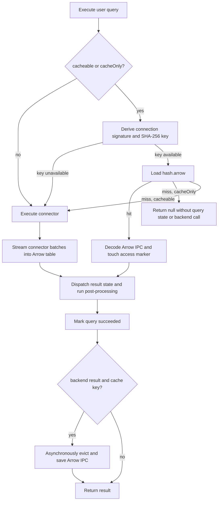

# Query Result Cache

DashQL caches successful user-query results in session-local files. A repeat of the same executable SQL against the same connection can load the cached Arrow result without contacting the backend. The cache is an optimization: cache lookup, eviction, and write failures do not make a query fail. Arrow IPC decode failures follow the normal query failure path and can be corrected by deleting the entry.

## Scope

The cache stores an Arrow IPC stream for a result table. It applies only when the caller opts in through `QueryExecutionArgs.cacheable` or `QueryExecutionArgs.cacheOnly`.

Notebook user queries opt in, including explicit execution, execute-on-send, agent-triggered visualization re-execution, and reruns. Internal catalog, setup, and health-check queries do not set either flag and therefore never read or write the cache.

`cacheOnly` is a stricter opt-in used by visible Vega-Lite visualization cards. It loads a cached result when available, but on a miss it neither registers query state nor executes against the connection. UMAP visualizations and ordinary SQL cards are not auto-run this way.

The cache is deliberately not a general consistency mechanism. It assumes that a result is a pure function of its connection signature and query text. Callers must not mark a query cacheable when that assumption does not hold.

## Cache Key

Each entry is addressed by a lowercase SHA-256 digest:

```
SHA-256(stableJson(connectionParamsSignature) + "\n" + queryText)
```

`createConnectionParamsSignature` produces the connector-specific signature and excludes transient connection state. Before hashing, `computeQueryResultCacheKey` recursively sorts object keys to make serialization independent of insertion order. The query string is used verbatim, so semantically equivalent SQL with different whitespace or spelling has distinct entries.

Result analysis and visualization projection are not part of the key. The executor always runs post-processing after either a cache hit or a backend result, allowing the same raw Arrow table to support the relevant analysis flow.

If the executor cannot recover connection parameters or derive a signature, it treats the query as non-cacheable and executes normally. Key derivation is also best-effort and must not expose an error to the query path.

## Storage Layout

The `StorageBackend` interface owns all cache operations, so the executor does not depend on OPFS or Tauri filesystem APIs.

| Backend | Cache location |
| --- | --- |
| OPFS | `sessions/<session-uuid>/cache/` |
| Native | `<session-directory>/cache/` |

For a key `<hash>`, the cache contains:

```
cache/
  <hash>.arrow
  <hash>.arrow.last_access
```

`<hash>.arrow` is the authoritative Arrow IPC stream. Its modification time is the entry's cached-at time. `<hash>.arrow.last_access` is an empty companion file whose modification time records the most recent cache access. Native sessions create a top-level `.gitignore` containing `cache/` when the first entry is written, but only if the user has not already created that file.

The storage interface exposes load, save, touch, list, and delete operations. `CompositeStorageBackend` routes those methods by session UUID to the session's OPFS or native backend.

Session archives and storage migration copy the persisted session metadata, schema, notebook scripts, and draft; they do not copy cache files. Deleting an OPFS session removes its complete session directory and cache. Deleting or clearing a native session unregisters it but intentionally retains its user-owned directory, including the cache.

## Execution Flow



The normal cacheable path computes the key before query state is registered. A cache-only request performs its lookup before registering state, which makes a miss a true no-op. It passes a successful preload to the later read path so a hit is only read once.

On a cache hit, the executor decodes the stored bytes with `arrow.tableFromIPC`, dispatches the same completed-result state used by a streamed query with empty metadata and zeroed stream metrics, then enters the shared analysis and success path. It records the cache key, cached-at timestamp, and `servedFromCache` state for the UI. A cache hit also asynchronously rewrites the empty access marker; it never rewrites the potentially large Arrow payload.

On a miss, the executor streams the backend result into an Arrow table as usual. After the query succeeds, it serializes the table with `arrow.tableToIPC(table, 'stream')` and saves it asynchronously. The caller is not blocked on the eviction scan or filesystem write. A successful save records the cache key on the finished query, while a failed save only produces a log warning.

Cancellation during an asynchronous cache read is treated like any other cancellation. Cache lookup and write failures are logged and fall back to normal execution where applicable. An Arrow IPC decode failure occurs after a hit has been selected, so it is reported as a failed query rather than falling back to the backend.

## Capacity and Eviction

Each session cache has independent defaults:

| Limit | Default |
| --- | ---: |
| Total Arrow payload bytes | 512 MiB |
| Arrow payload files | 200 |

Before a save, `evictToFit` lists all payload files, totals their sizes, and deletes least-recently-used entries until both the incoming result and the retained entries fit. It sorts on the `.last_access` marker modification time. If the marker is missing, the payload modification time is used, so an entry falls back to write-time ordering.

The policy counts and sizes payloads only; access markers do not count as entries. Deleting an entry removes its payload and marker. During a save-time listing, each backend also attempts to remove orphaned markers left behind by a crash or external file change.

Eviction is best-effort and non-transactional. Concurrent writers can observe approximate totals, concurrent deletion of an entry is tolerated, and an individual result larger than the byte budget may still be written after the cache is emptied. A later save will evict it if necessary.

## User Experience

For a succeeded result, the query result header shows its execution age. When the result was served from cache, that age is based on the Arrow payload's original write time rather than the latest cache access.

The **Refresh** action deletes the current query's cache entry when a key is available, then re-executes the resolved notebook query. This forces a backend result on the next execution and repopulates the entry after success. Deletion is best-effort; a failed deletion may permit the old entry to be reused.

The internals overlay includes a session-scoped **Query Cache** tab. It lists payload key, size, cached-at time, and last-access time; provides manual refresh of the listing; and allows individual entry deletion. The list omits `.last_access` markers.

## Limits and Correctness

- Cache identity is scoped by the connection signature and exact query text, but not by an explicit cache version, TTL, backend data version, or catalog version.
- The cache may return stale data after a backend changes. Use Refresh to invalidate a visible result, or change the SQL/signature to create a new key.
- Corrupt or incompatible Arrow bytes are not self-healed by automatic deletion. Decode errors follow the executor's normal failure path; the entry can be removed from Refresh or the cache inspector.
- A duplicate write for the same hash is safe because both writers represent the same key; last writer wins.
- The cache preserves raw results only. Analyses and projections run again after cache load, and cache-only UMAP auto-run is intentionally disabled because projection work is too expensive to trigger on visibility.

## Implementation References

- Key derivation: `packages/dashql-app/src/connection/query_result_cache_key.ts`
- Executor integration: `packages/dashql-app/src/connection/query_executor.tsx`
- Cache contract: `packages/dashql-app/src/platform/storage/storage_backend.ts`
- Eviction policy: `packages/dashql-app/src/platform/storage/query_result_cache_eviction.ts`
- OPFS and native implementations: `packages/dashql-app/src/platform/storage/opfs_storage_backend.ts`, `packages/dashql-app/src/platform/storage/native_storage_backend.ts`
- Cache inspection UI: `packages/dashql-app/src/view/internals/query_cache_view.tsx`
