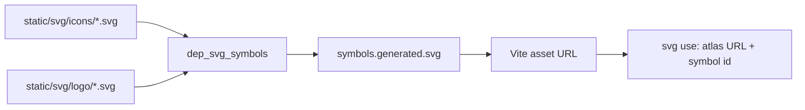

# UI Icons

DashQL stores UI icons and logos as individually previewable SVG files, but the application does not
load those files one by one. Bazel extracts every SVG `<symbol>` into one generated symbol atlas. UI
code imports the atlas URL and addresses a symbol by fragment identifier.



This arrangement keeps icon geometry in SVG, avoids importing a React component for every icon, and
allows the browser and bundler to handle one shared asset.

## Source Layout

Atlas inputs live under:

```text
packages/dashql-app/static/svg/
  icons/   # UI glyphs
  logo/    # DashQL and connector/product marks
```

Files under `static/svg/experimental/` are not atlas inputs. Adding an SVG there does not make its
symbol available to application code.

Each atlas source is a complete SVG document with one or more `<symbol>` elements. In the usual case,
one file defines one symbol and renders it once with a trailing `<use>`. For example:

```svg
<svg version="1.1"
     xmlns="http://www.w3.org/2000/svg"
     xmlns:xlink="http://www.w3.org/1999/xlink">
    <symbol id="check_16" viewBox="0 0 16 16">
        <path fill="currentColor" d="..." />
    </symbol>
    <use xlink:href="#check_16" />
</svg>
```

The two parts serve different purposes:

- `<symbol>` is the reusable definition copied into the atlas.
- The outer `<svg>` and trailing `<use>` make the source file render when opened directly. The atlas
  generator discards both of them.

The trailing preview reference should match the symbol id, but it has no effect on the generated
atlas. A bad preview reference can therefore make the source file look empty while the application
symbol still works.

## Symbol Contract

Follow these rules when adding or editing a symbol:

- Give every symbol a globally unique `id`. All icon and logo symbols share one atlas namespace.
- Treat the `id` as the runtime API. Code references the `<symbol id>`, not the filename. Existing
  files include cases such as `search_24.svg` defining `id="search"`.
- Keep the filename aligned with the id for new files. Use lower-case snake case and append the
  designed canvas size when it is part of the icon variant, for example `check_16.svg` with
  `id="check_16"`.
- Set an explicit `viewBox` on the symbol. It defines the intrinsic coordinate system and scaling;
  the consuming `<svg>` defines the displayed width and height.
- Use `fill="currentColor"`, `stroke="currentColor"`, or an equivalent style for monochrome icons.
  They then inherit the CSS `color` of the consuming element, including hover, disabled, and theme
  states.
- Preserve intentional fixed fills for multicolor product and connector marks. The `*_nocolor` and
  `*_outlines` logo variants exist when a themeable mark is needed.
- Keep reusable resources such as `<defs>`, masks, and clip paths inside the symbol. Their ids also
  enter the shared document namespace, so make those ids globally unique as well.
- Do not rely on attributes of the source file's outer `<svg>`. Only descendant `<symbol>` elements
  and their contents are copied.
- Keep the trailing `<use xlink:href="#..." />` correct so the standalone source remains previewable.

The size suffix describes the geometry's intended design grid, not an enforced render size. Prefer a
symbol designed for the displayed size where one exists, rather than shrinking a 24-pixel glyph to
16 pixels and accepting softer alignment.

## Atlas Generation

`packages/dashql-app/BUILD.bazel` defines two filegroups over `static/svg/icons/*.svg` and
`static/svg/logo/*.svg`. The `dep_svg_symbols` genrule passes them to
`packages/dashql-app/utils/generate_svg_symbols.py` and writes:

```text
bazel-bin/packages/dashql-app/dependencies/svg-symbols/symbols.generated.svg
```

The generator parses every input as XML, finds all SVG-namespace `<symbol>` descendants, and appends
each symbol element to a new root `<svg>`. It does not validate ids, deduplicate symbols, rewrite
internal references, infer a `viewBox`, or copy non-symbol siblings.

Do not edit `symbols.generated.svg`; it is a Bazel output. Change a source SVG and rebuild the
generator target instead:

```bash
bazel build //packages/dashql-app:dep_svg_symbols
```

The generated atlas is a declared dependency of the Vite web, native, development, and application
test targets. Production Vite configurations point at a build-local copy; the development
configuration points at the corresponding `bazel-bin` output. TypeScript resolves the import through
the path mapping and module declaration described below; the type-check target does not consume the
SVG contents.

## Import Resolution

Application code imports a virtual module rather than a source SVG:

```ts
import symbols from '@ankoh/dashql-svg-symbols';
```

The module's default export is the URL emitted for the generated atlas. Resolution is wired in three
places:

- `packages/dashql-app/vite.config.tpl.ts` aliases the module to the generated SVG.
- `tsconfig.json` maps the module to the same Bazel output for TypeScript resolution.
- `packages/dashql-app/types/svg-symbols.d.ts` declares its default export.

The imported value is an atlas URL, not parsed SVG markup and not a map of symbol names. Append
`#<symbol-id>` to create an SVG external fragment reference.

## Rendering Symbols

### JSX

For a direct React rendering, create the viewport and reference the atlas symbol:

```tsx
import symbols from '@ankoh/dashql-svg-symbols';

export function CheckIcon() {
    return (
        <svg width="16px" height="16px" aria-hidden="true">
            <use xlinkHref={`${symbols}#check_16`} />
        </svg>
    );
}
```

The `<svg>` controls layout size and receives inherited `color`; the referenced symbol supplies its
`viewBox` and geometry. Dynamic references use the same form:

```tsx
<use xlinkHref={`${symbols}#${symbolId}`} />
```

Some component APIs, such as vertical-tab properties, carry the complete reference instead:

```ts
const icon = `${symbols}#table_24`;
```

### Icon Components

Use the named icon components from `src/ui/foundations/symbol_icon.tsx` when rendering a standard
application icon or passing one to a component property such as `leadingVisual`:

```tsx
import { CheckIcon } from './ui/foundations/symbol_icon.js';

<Button leadingVisual={CheckIcon}>Apply</Button>
```

Named components choose the closest natural symbol variant that does not exceed the displayed size.
Use `SymbolIcon('symbol_id')` for dynamic symbols or symbols that do not need a named export. It
caches a component per symbol id but does not verify that the symbol exists.

Icon components accept numeric sizes and the named sizes `small`, `medium`, and `large`, which map to
16, 32, and 64 pixel square viewports. They forward standard SVG properties. Unlabelled icons are
decorative and hidden from assistive technologies by default; an explicit `aria-label` or
`aria-labelledby` exposes the SVG with an image role.

### Imperative DOM Code

CodeMirror and other non-React integrations construct the same SVG structure with namespace-aware DOM
APIs:

```ts
const svg = document.createElementNS('http://www.w3.org/2000/svg', 'svg');
svg.setAttribute('width', '16px');
svg.setAttribute('height', '16px');

const use = document.createElementNS('http://www.w3.org/2000/svg', 'use');
use.setAttributeNS(
    'http://www.w3.org/1999/xlink',
    'xlink:href',
    `${symbols}#check_16`,
);
svg.appendChild(use);
```

Use the SVG namespace for both elements and the XLink namespace for the existing `xlink:href`
convention.

## Accessibility

The symbol is only graphics. Accessibility belongs to the consuming UI because the same symbol may be
decorative in one place and meaningful in another.

- Hide decorative SVGs with `aria-hidden="true"` when they are not already excluded by their
  accessible parent.
- Give icon-only controls an accessible name on the control. DashQL's `IconButton` requires an
  `aria-label`; do not use the SVG filename or symbol id as user-facing text.
- If a standalone SVG conveys information not present in adjacent text, give the outer `<svg>` an
  appropriate accessible name, for example with `role="img"` and `aria-label`.
- Do not put titles or labels into shared symbols. They would be reused in every context and cannot
  express the consuming control's intent.

## Adding An Icon

1. Search `packages/dashql-app/static/svg/icons/` and `static/svg/logo/` for an existing symbol and
   size variant before adding one.
2. Add a complete SVG document to the appropriate directory using the source shape above.
3. Make the filename, symbol id, `viewBox`, preview `<use>`, and intended color behavior agree.
4. Build the atlas with `bazel build //packages/dashql-app:dep_svg_symbols`.
5. Confirm the symbol id appears in
   `bazel-bin/packages/dashql-app/dependencies/svg-symbols/symbols.generated.svg` and inspect the icon
   in its consuming UI.
6. Run the relevant Bazel verification target. For application code changes, use at least:

```bash
bazel test //packages/dashql-app:tsc_typecheck_test
```

Run `bazel test //packages/dashql-app:test` as well when behavior or components changed. An SVG-only
change has no dedicated visual test, so standalone preview and in-context inspection remain important.

## Common Failures

| Symptom | Likely cause |
|---|---|
| Source SVG previews blank, atlas reference works | The trailing preview `<use>` points at the wrong id. |
| Icon is absent in the application | The runtime fragment does not exactly match the symbol id, the file is outside an atlas input directory, or the atlas has not been rebuilt. |
| Icon renders black instead of following the UI | Geometry has a fixed/default fill instead of `currentColor`. |
| Icon is clipped or scaled incorrectly | The symbol has a missing or incorrect `viewBox`, or the consuming viewport has an unsuitable aspect ratio. |
| One of two symbols behaves unpredictably | A symbol id or an internal resource id is duplicated in the shared atlas namespace. |
| Changes to the outer `<svg>` disappear after generation | The generator copies only `<symbol>` elements. |

There is currently no generated TypeScript union or runtime registry of valid symbol ids. Symbol
references are string-based, so exact ids and visual verification are part of the icon workflow.
