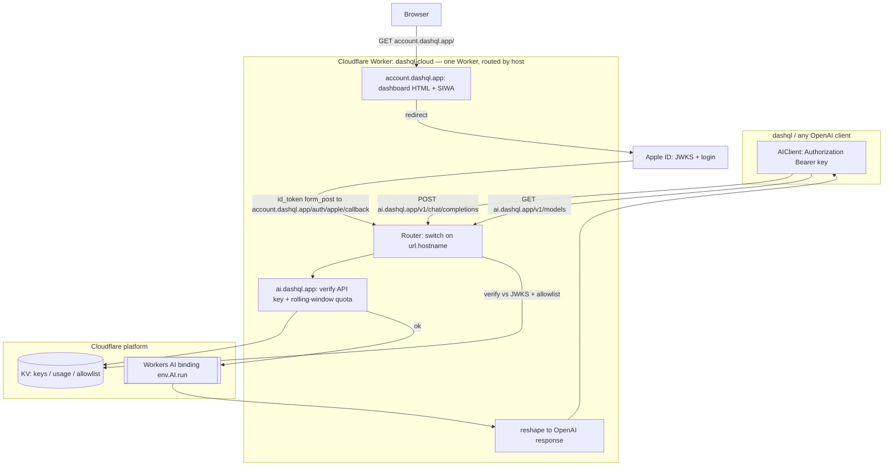

# dashql-cloud — Minimal SLM Gateway + Account Dashboard on Cloudflare

> **Status: WIP design doc.** Living document for the `packages/dashql-cloud` package (the
> `ai.dashql.app` gateway + `account.dashql.app` dashboard, one Worker). Reflects the decisions
> made while scoping the feature; update it as the implementation evolves.

## Context

Cloudflare Workers AI hosts small language models (SLMs) at a very cheap price point
(10,000 neurons/day free, then $0.011 per 1k neurons — e.g. `llama-3.2-1b-instruct` is
~2.5k neurons per **million** input tokens). The goal is a minimal gateway that exposes
these models over an **OpenAI-compatible API**, gatekept by a **simple account system**, so
that dashql (and any OpenAI-compatible client) can use it.

dashql already speaks this protocol. `packages/dashql-app/src/platform/ai_client.ts` calls
`GET /v1/models` (Test button) and `POST /v1/chat/completions` with
`{model, messages, stream:false}`, expecting `{choices:[{message:{content}}]}` back, and
authenticates via a **user-configured `Authorization: Bearer …` header** set in the AI
settings UI (`packages/dashql-app/src/view/internals/ai_settings_view.tsx`). So a gateway
that matches this contract drops in with **zero dashql code changes** — the user just points
the "Endpoint URL" at the gateway and adds an `Authorization` header.

## Decisions

- **No payments in v1.** Apple Pay is only a wallet — it cannot settle funds without a
  processor (Stripe/etc.), so "Apple-only billing" is impossible. Billing is deferred; the
  gate is an **allowlist of Apple accounts**.
- **Login = Sign in with Apple** (an Apple Developer account already exists, so the web setup
  is cheap: one Service ID + key, no extra fee).
- **Allowlist behavior:** anyone can *Sign in with Apple*; only allowlisted accounts can mint
  an API key; everyone else logs in but gets an authorization error on key creation.
- **Location:** `packages/dashql-cloud/` inside the dashql repo (not a separate repo). It stays
  **outside** the Bazel/Cargo build graph — Cloudflare's toolchain (wrangler) doesn't fit
  them. Because it's a **Rust** crate (not a JS package), living under `packages/` is safe —
  pnpm's `packages/*` glob only adopts dirs containing a `package.json`, and this crate has
  none. Isolation from the root Cargo workspace is achieved by two facts:
  - The root `Cargo.toml` uses an **explicit `members` list** (not a glob) — its members are
    `packages/dashql-native`, `packages/tauri-aclgen`, `packages/dashql-pack`. A crate not on
    that list is not pulled in.
  - `packages/dashql-cloud/Cargo.toml` carries its **own `[workspace]` table**, making it an
    isolated workspace root so Cargo doesn't try to attach it to the parent (and Bazel's
    `crate_universe`, which consumes the root workspace, never ingests it).

  Constraints:
  - **Add `packages/dashql-cloud` to `.bazelignore`** so `//...` never scans it (matches the
    existing pattern that excludes node_modules / build trees).
  - **Do NOT add it to the root `Cargo.toml` `members`**.
  - The only coupling to dashql is the endpoint URL pasted into AI settings.
- **Public domains (two, one Worker):** a single Worker is bound to **both** custom domains
  and routes by hostname (assumes `dashql.app` is a zone on the same Cloudflare account):
  - **`ai.dashql.app`** — the machine API (`/v1/models`, `/v1/chat/completions`). This is the
    endpoint dashql points at.
  - **`account.dashql.app`** — the human login/dashboard (`/`, `/auth/apple/callback`,
    `/keys`). The SIWA return origin registered with Apple lives here.
  - Splitting the surfaces keeps the inference URL clean and puts the Apple callback under an
    "account" host where it semantically belongs. The Worker's router branches on
    `url.hostname` first, then method+path.
- **Client contract:** dashql-shaped, i.e. implement the `/v1/models` shim too (Workers AI's
  compat layer does **not** provide `/v1/models`, but dashql's Test button needs it).
- **Language: Rust** (`workers-rs`), not TypeScript — fits the repo's existing Cargo/Rust
  packages. Confirmed support: the Workers **AI binding** (`worker::Ai`), KV, secrets/vars,
  `fetch`, `Router`, and custom domains; compiles to `wasm32-unknown-unknown`, deploys via
  wrangler. **One caveat to design around:** JWT/JWKS verification can't use JS libs and the
  common `jsonwebtoken` crate depends on `ring` (unreliable on `wasm32-unknown-unknown`), so
  Apple `id_token` verification uses **pure-Rust RS256** (`rsa` + `sha2` + `base64`, no
  `ring`) against Apple's JWKS.

## Architecture



Two front doors on one Worker, split by hostname:

1. **`account.dashql.app`** — human dashboard (browser): Sign in with Apple → if allowlisted,
   "Create API key". Serves `/`, `/auth/apple/callback`, `/keys`.
2. **`ai.dashql.app`** — machine API (dashql): OpenAI-compatible, authenticated by the minted
   key. Serves `/v1/models`, `/v1/chat/completions`.

## API contract (must match dashql's AIClient)

- `GET /v1/models` → `{ "object":"list", "data":[{"id":"@cf/meta/llama-3.2-1b-instruct"}, …] }`
  — a **static allowlist** of enabled CF model ids. This is what dashql's Test button hits.
- `POST /v1/chat/completions` with `{model, messages, stream:false}`:
  - verify `Authorization: Bearer <key>`; reject 401 if unknown/revoked.
  - enforce two **rolling-window** budgets per key, both reset on a **deployment-wide** cadence
    (`QUOTA_WINDOW_SECS`, default 5h): a **request cap** (`REQUEST_LIMIT`) and a **neuron cap**
    (`NEURON_LIMIT`). Both KV counters are keyed by the window's absolute start timestamp;
    reject 429 over either (the error says which). The request slot is charged up front; the
    neuron cost is charged *after* inference from the response's token counts.
  - validate `model` ∈ enabled set; call the AI binding — `env.ai("AI")` → `Ai::run(model,
    inputs)` with `{ messages }` (see `worker::Ai`).
  - reshape Workers AI's `{ response, usage }` into `{ choices:[{ message:{ role:"assistant",
    content } }], model, object:"chat.completion", usage }` (serde structs) — the `usage` token
    counts are echoed back and also drive neuron accounting.
  - Non-streaming only (all dashql uses). Streaming can be added later.

Reuse note: no dashql changes required — the existing `AIClient.generate`/`listModels`
already produce/consume exactly these shapes (`ai_client.ts:57-101`).

## Sign in with Apple (web) flow — no runtime private key needed

Use `response_type=code%20id_token` + `response_mode=form_post`. Apple POSTs the `id_token`
directly back, so the gateway **verifies the token** and never needs to exchange the code
(so no client-secret JWT / private key at runtime — only the Service ID as `aud`).

Verification is **pure-Rust RS256** (no `ring`, no JS): parse the JWT header/claims with
`base64` + `serde_json`, fetch Apple's JWKS (`https://appleid.apple.com/auth/keys`) via
`worker::Fetch`, pick the key by `kid`, build an `rsa::RsaPublicKey` from the `n`/`e`
components, and verify the RS256 signature with `rsa` + `sha2`. Cache the JWKS in KV briefly
to avoid refetching on every login.

All routes below are served on **`account.dashql.app`**.

1. `GET /` serves a page with a "Sign in with Apple" button → redirect to
   `https://appleid.apple.com/auth/authorize?...` (with `redirect_uri =
   https://account.dashql.app/auth/apple/callback`).
2. `POST /auth/apple/callback` (form_post): verify the `id_token` with the pure-Rust RS256
   path above (`iss == https://appleid.apple.com`, `aud == <Service ID>`, `exp`), reading the
   form body via `req.form_data()`. Extract `sub` (stable id) and `email`.
3. Issue a short-lived **signed session cookie** (HMAC via `hmac` + `sha2`, secret in
   `SESSION_SECRET`).
4. Redirect to dashboard: if the session email has an `enabled` entry in the `DASHQL_CLOUD_ACCOUNTS`
   namespace → show "Create API key"; else show "Your Apple account isn't authorized for a key.
   Contact the admin."
5. `POST /keys` (session-gated + allowlist-gated): generate `dashql_<random>`, store
   `sha256(key) → { appleSub, email, createdAt, requestLimit, neuronLimit }` in KV, return the
   plaintext **once**. `GET /keys` lists existing (by prefix) with live per-window usage and
   revoke buttons; `DELETE /keys/:id` revokes.

Allowlist note: the allowlist is keyed by **email** (`DASHQL_CLOUD_ACCOUNTS`), so seed the exact
address Apple returns — which is the **private-relay** address if the user chose Hide My Email.
Keys themselves are owned by the stable Apple `sub`, so a later email change doesn't strand a
user's existing keys; only their *allowlist* entry would need re-adding under the new email.

## Storage (Cloudflare KV — no D1 needed for v1)

- **Allowlist** (`DASHQL_CLOUD_ACCOUNTS` namespace): `<lowercased-email>` → `{ enabled, addedAt }`.
  A dedicated namespace, so the key is the bare email and the namespace *is* the allowlist — it's
  the single source of truth for who may mint a key. Presence means allowlisted; `enabled: false`
  suspends without deleting; a bare `{}` counts as enabled; **no entry means denied** (fails
  closed). Edited live with `wrangler kv key put/delete` — no redeploy. (Chosen over a
  comma-separated `ALLOWED_EMAILS` var so the list changes without a deploy and each account can
  be individually suspended.)
- **Keys** (`DASHQL_CLOUD_API_KEYS` namespace): `sha256(key)` → `{ appleSub, email, createdAt, requestLimit,
  neuronLimit }`. Only the per-key *budgets* live here; the reset cadence is deployment-wide,
  not per key.
- **Quota window** (`QUOTA_WINDOW_SECS` var, default 18000 = 5h, like Claude subscriptions): a
  deployment-wide reset cadence read fresh per request, so a redeploy re-buckets every key at
  once rather than only affecting new keys.
- **Usage** (`DASHQL_CLOUD_API_KEY_USAGE` namespace): two counters per key per window, both with KV TTL so
  they self-expire — `${sha256(key)}:${windowStartSecs}:r` (requests) and `…:n` (**neuron-
  micros** = neurons × 1e6, so `tokens × neurons-per-M-tokens` stays an exact integer).
  `windowStartSecs` is `now` aligned down to the window length, in absolute epoch seconds — an
  actual timestamp, not a `now / window` index. That's what makes changing the window on
  redeploy safe: the new value's counters land on different KV keys than the old value's, so
  they never collide (the stale ones just TTL away). Enforces the per-window caps and protects
  the shared 10k-neuron free tier.
- **Neuron rates**: neurons are Cloudflare's GPU-compute unit. They aren't returned per request,
  but the response's `usage` token counts are, and CF publishes a fixed *neurons-per-million-
  tokens* rate per model (e.g. `llama-3.2-1b`: 2457 in / 18252 out). The gateway holds a small
  table of these ([`ai.rs`]) and computes each request's neuron cost as `promptTokens × inRate +
  completionTokens × outRate`. Re-check the table if CF changes pricing.
- **Concurrency caveat**: counters are read-modify-write KV, not atomic, so parallel requests on
  one key can under-count. Acceptable for a personal gateway; strict accounting would move the
  counters to a Durable Object (upgrade path).

## Files (`packages/dashql-cloud/`)

```
packages/dashql-cloud/
  wrangler.jsonc      # AI binding, KV namespaces, vars, custom domains
  Cargo.toml          # isolated crate: own [workspace] table so it's NOT a root member
  src/
    lib.rs            # #[event(fetch)] entry; Router: branch on host, then method+path
    apple.rs          # SIWA authorize URL + pure-Rust RS256 id_token verification (rsa+sha2)
    session.rs        # sign/verify HMAC session cookie (hmac + sha2)
    keys.rs           # generate/hash/verify keys; KV read/write; request + neuron quota check
    ai.rs             # worker::Ai::run wrapper + OpenAI reshaping; model set + neuron-rate table
    dashboard.rs      # minimal HTML for login + key management
  README.md           # setup + Apple config steps
```

Key crates (all `wasm32-unknown-unknown`-clean, no `ring`): `worker` (workers-rs),
`serde`/`serde_json`, `rsa`, `sha2`, `hmac`, `base64`, `getrandom` (with the `js` feature for
WASM randomness).

**Repo integration (keep it out of the build graph):**

- Append `packages/dashql-cloud` to the repo `.bazelignore`.
- Do **NOT** add `packages/dashql-cloud` to the root `Cargo.toml` `members` list (it's an
  explicit list, not a glob — see the existing non-member `packages/hyper-http-proxy` for
  precedent). Give `packages/dashql-cloud/Cargo.toml` its **own empty `[workspace]` table** so
  Cargo treats it as an isolated workspace root and Bazel's `crate_universe` never ingests it.
- No `package.json`, so pnpm's `packages/*` glob does not adopt it; wrangler is invoked
  directly (`npx wrangler …` or a globally installed wrangler) from `packages/dashql-cloud/`.

`wrangler.jsonc` essentials:

```jsonc
{
  "name": "dashql-cloud",
  "main": "build/worker/shim.mjs",       // generated by workers-rs build
  "compatibility_date": "2026-01-01",
  "build": { "command": "cargo install -q worker-build && worker-build --release" },
  "ai": { "binding": "AI" },
  "kv_namespaces": [
    { "binding": "DASHQL_CLOUD_API_KEYS", "id": "…" },
    { "binding": "DASHQL_CLOUD_API_KEY_USAGE", "id": "…" },
    { "binding": "DASHQL_CLOUD_ACCOUNTS", "id": "…" }
  ],
  "routes": [
    { "pattern": "ai.dashql.app", "custom_domain": true },
    { "pattern": "account.dashql.app", "custom_domain": true }
  ],
  "vars": {
    "APPLE_SERVICE_ID": "app.dashql.account", "ACCOUNT_ORIGIN": "https://account.dashql.app",
    "REQUEST_LIMIT": "500", "NEURON_LIMIT": "10000", "QUOTA_WINDOW_SECS": "18000"
  }
}
```

(`workers-rs` uses a small generated JS shim + WASM; wrangler runs `worker-build`, no
hand-written TS.) Secrets via `wrangler secret put`: `SESSION_SECRET`.

## One-time Apple setup (uses existing developer account)

1. Certificates, Identifiers & Profiles → **Identifiers → Services ID** (this becomes the
   OAuth `client_id` / `aud`). Enable **Sign in with Apple**, attach to your primary App ID.
2. Under Website URLs, register domain `account.dashql.app` + return URL
   `https://account.dashql.app/auth/apple/callback`. No domain-verification file needed for
   SIWA.
3. (Only if you later switch to the code-exchange flow) create a Key for Sign in with Apple.
   Not required for the `form_post` id_token approach used here.

## Implementation order

1. Scaffold the crate (`cargo generate cloudflare/workers-rs`) at `packages/dashql-cloud/`; give
   it its own `[workspace]` table; wire the `AI` binding + KV in `wrangler.jsonc`; stub the
   `Router` branching on host.
2. `ai.rs` + `/v1/models` + `/v1/chat/completions` with a **hardcoded test key** — verify
   generation works against Workers AI end-to-end (`wrangler dev`) before touching auth.
3. `keys.rs` + KV: real key verification + rolling-window quota; drop the hardcoded key.
4. `apple.rs` (pure-Rust RS256) + `session.rs` + `dashboard.rs`: SIWA login, allowlist gate,
   key CRUD.
5. Deploy; register the real callback URL with Apple; harden (CORS, error shapes, logging,
   WASM bundle size via LTO/strip/`wasm-opt`).

## Verification

- **Local API (no SIWA):** `wrangler dev`, then
  `curl localhost:8787/v1/models -H "Authorization: Bearer <testkey>"` and a
  `POST /v1/chat/completions` with `{"model":"@cf/meta/llama-3.2-1b-instruct",
  "messages":[{"role":"user","content":"hi"}],"stream":false}` — assert the
  `{choices:[{message:{content}}]}` shape and a non-empty completion.
- **Quota:** loop the POST past `REQUEST_LIMIT` within one window; assert a 429 and that the KV
  request counter increments. Separately, run enough tokens to exceed `NEURON_LIMIT` and assert
  a 429 that names the neuron budget. Assert both counters reset once the window
  (`QUOTA_WINDOW_SECS`) rolls over.
- **SIWA:** must be tested on the **deployed** Worker over HTTPS at
  `https://account.dashql.app/` with the registered return URL (Apple rejects localhost). Log
  in with an allowlisted account → key appears; log in with a non-allowlisted account →
  authorization error, no key.
- **dashql end-to-end:** in dashql AI settings, set Endpoint URL to `https://ai.dashql.app`,
  Model to an enabled `@cf/…` id, add header `Authorization: Bearer <key>`; click **Test**
  (hits `/v1/models`) → "Reachable"; then run an agent action → completion flows through it.

Rust-specific verification notes: build with `worker-build --release` and watch the WASM
bundle size (Workers has a compressed-size limit; LTO + `strip` + `wasm-opt` keep it small).
Unit-test the pure-Rust pieces (RS256 verify against a known JWKS fixture, key hashing,
response reshaping) with plain `cargo test` on native target where they don't touch `worker`.

## Out of scope for v1 (noted upgrade paths)

- Payments/subscriptions (add Stripe Checkout later; Apple Pay rides along automatically).
- Streaming responses (`stream:true`), embeddings, per-model pricing display.
- Self-serve signup (allowlist stays admin-controlled).
