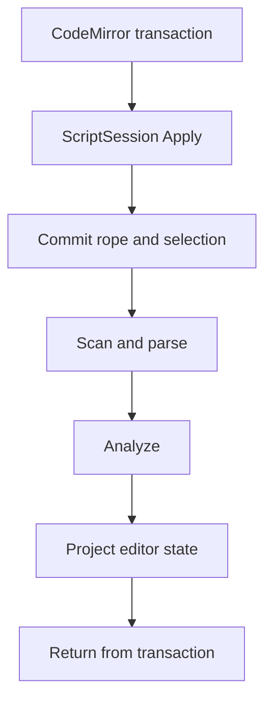
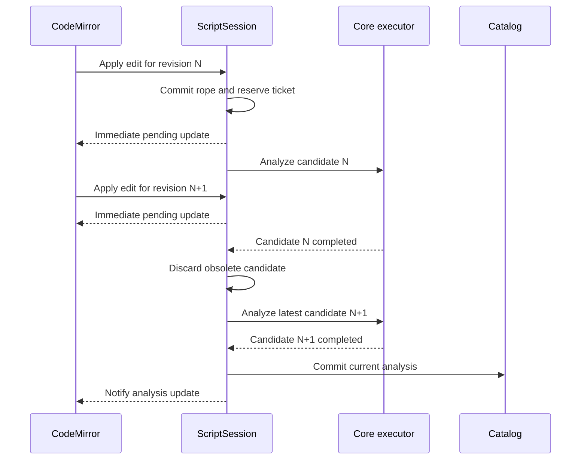
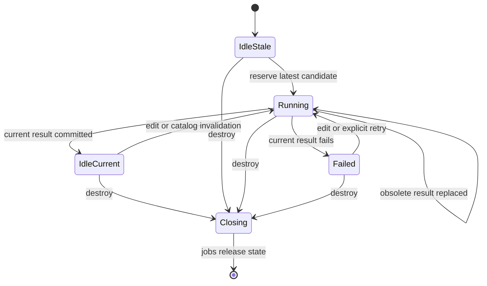

# Asynchronous Editor Analyzer

## Status

Work in progress. This document proposes asynchronous scanning, parsing, and analysis for editable
`ScriptSession` documents. It complements `parallel_analyzer.md`, which introduced the shared Core
worker pool for independent catalog scripts.

## Motivation

CodeMirror document edits must remain synchronous: an accepted transaction must update the native
rope and document revision before the next transaction is applied. Scanning, parsing, semantic
analysis, and editor projection do not need to block that transaction.

The editor should therefore:

- Apply text and selection changes synchronously and in order.
- Branch the current document into an isolated analysis candidate.
- Run the complete scan, parse, and analysis pipeline on a Core worker.
- Continue accepting edits while that candidate is running.
- Merge a completed candidate only when it still describes the desired document and catalog.
- Discard obsolete candidates and schedule the latest uncovered revision.
- Keep the last successfully analyzed catalog entry published until a current replacement is ready.

The initial policy permits one in-flight analysis per editable session. The scheduler must represent
this as configurable capacity rather than encoding a singular optional job throughout the design.

## Current Behavior

Every CodeMirror document transaction is converted to an `EditorEvent` and synchronously passed to
`ScriptSession::Apply()`. A document-changing event currently requests analysis in that call. Core
then updates the rope, scans, parses, analyzes under the catalog read lock, places the cursor, builds
the complete `EditorUpdate`, and only then returns to CodeMirror.



This path is implemented primarily in:

- `packages/dashql-app/src/app/notebook/scripts/editor/dashql_processor.ts`
- `packages/dashql-core/src/script_session.cc`
- `packages/dashql-app/src/app/notebook/scripts/notebook_scripts.ts`

Core already provides a two-worker asynchronous analysis executor in
`packages/dashql-core/src/async_analysis.cc`. Its existing normal-`Script` jobs are not suitable for
editable sessions because they mark the source `Script` busy for the complete job. An editor must be
able to mutate its authoritative rope while an older candidate is being analyzed.

## Goals

- No scanner, parser, analyzer, or analysis-projection work on the CodeMirror transaction stack.
- Ordered, synchronous rope edits with stale-document compare-and-swap validation.
- At most the configured number of analyses in flight for one session; initially one.
- No eager cancellation requirement for a running analysis.
- Exact late validation before a candidate can affect editor or catalog state.
- Automatic analysis of the latest revision after an obsolete candidate finishes.
- Last-good catalog declarations remain visible while newer text is being analyzed.
- One shared Core module, catalog, heap, and worker pool in browser and Electron builds.
- Removal of the synchronous `ScriptSession` analysis API after migration.

## Non-Goals

- Parallelizing scanner, parser, or analyzer passes within one candidate.
- Making the generic `rope::Rope` type responsible for editor scheduling.
- Removing synchronous `Script::Analyze()` from non-editor workflows.
- Interrupting analyzer code in the middle of a running pass.
- Publishing every intermediate revision that happened to finish analysis.
- Introducing a second worker pool or an independent Core module per editor.

## Proposed Architecture

The authoritative `ScriptSession` remains the synchronous owner of document text and selection.
Analysis jobs operate on independent candidates and report completion back to the session.



The worker callback is only a notification that a session update is available. TypeScript collects
the plain `EditorUpdate` and delivers it through a CodeMirror state effect. CodeMirror state fields
remain synchronous and never await worker completion.

## Session Scheduler State

The scheduler belongs to heap-owned `ScriptSession` state. It does not belong in `rope::Rope`: the
protected invariant includes text, revisions, selection, analysis candidates, publication intent,
and lifetime.

Conceptually:

```cpp
struct AnalysisRequest {
    AnalysisTicket ticket;
    uint64_t document_revision;
    uint64_t catalog_revision;
};

struct AnalysisSchedulerState {
    uint64_t desired_document_revision;
    uint64_t desired_catalog_revision;
    uint32_t max_in_flight = 1;
    std::unordered_map<AnalysisTicket, AnalysisRequest> in_flight;
};

struct ScriptSessionState {
    std::mutex document_mutex;
    Script live_script;
    uint64_t document_revision;
    uint64_t state_revision;
    std::optional<EditorSelection> primary_selection;
    AnalysisSchedulerState analysis;
    std::optional<CatalogEntry::Rank> publication_rank;
    bool closing;
};
```

`max_in_flight = 1` is the initial policy. The implementation must nevertheless reason about a set
of requests and whether the desired revision is already covered. This allows the limit to increase
later without replacing a singular `in_flight` assumption across Core, ABI, and TypeScript code.

The document mutex protects:

- Rope validation, mutation, and snapshot creation.
- Document and state revisions.
- Primary selection.
- Desired analysis revisions.
- Analysis ticket reservation and removal.
- Candidate adoption.
- Publication intent and session closing state.

It does not remain held during:

- Executor queue insertion.
- Scanning, parsing, or analysis.
- JavaScript notification.
- CodeMirror dispatch.

## Scheduler State Machine



With capacity one, edits made while a candidate is running only advance the desired revision. They
do not enqueue another job. When the candidate finishes, completion either commits it or reserves a
candidate for the latest desired revision before releasing the session lock.

For any capacity, the scheduler evaluates two independent questions:

1. Is the completed result still the desired result?
2. Is the desired revision already merged or covered by another request?

The second question must not be implemented as only `in_flight.empty()`.

## Edit Path

`ScriptSession::Apply()` remains synchronous but becomes limited to document and selection state.

While holding the document mutex:

1. Validate the event's expected document revision.
2. Validate all ranges against the pre-change document.
3. Apply the complete edit batch atomically to the live rope.
4. Update the primary selection against the post-change document.
5. Increment document and state revisions as applicable.
6. Mark the resulting document and current catalog generation as desired for analysis.
7. Clear analysis-derived editor projections that no longer match the document.
8. Determine whether an existing request covers the desired revision.
9. If not covered and capacity is available, branch the latest text and reserve a ticket.

After releasing the document mutex, submit any reserved work to the shared executor. The ticket
already occupies capacity before the executor is called, preventing another edit from reserving a
duplicate candidate. If submission fails, reacquire the document mutex and clear or fail that ticket
only if it is still the matching request.

The immediate `EditorUpdate` reports the accepted text and selection revisions and that analysis is
pending. It contains no stale diagnostics, syntax spans, semantic spans, cursor analysis, or script
annotations from the preceding document.

## Candidate Isolation

An analysis candidate owns a fresh processing graph:

```cpp
struct AnalysisCandidate {
    AnalysisTicket ticket;
    CatalogEntryID catalog_entry_id;
    uint64_t source_document_revision;
    uint64_t source_catalog_revision;
    TextVersion source_text_version;
    std::string text_snapshot;
    std::shared_ptr<ScannedScript> scanned;
    std::shared_ptr<ParsedScript> parsed;
    std::shared_ptr<AnalyzedScript> analyzed;
    buffers::statistics::ScriptProcessingTimings timings;
};
```

Requirements:

- Reuse the live session's stable catalog-entry ID.
- Always build a fresh `ScannedScript`, `ParsedScript`, and `AnalyzedScript`.
- Never share the live script's `ScannedScript::NameRegistry`; analysis mutates its tags and resolved
  object lists.
- Never mutate the live rope, cursor, analysis pointers, or catalog membership from the analysis
  phase.
- Initially materialize the rope into an owned string under the document mutex. A persistent or
  copy-on-write rope branch can be added later without changing scheduler semantics.
- Capture selection independently from semantic analysis. A selection change does not invalidate a
  candidate; the latest selection is used when an otherwise current result is committed.

The analyzer remains a synchronous algorithm inside the worker. “Asynchronous editor analysis”
means that the complete synchronous pipeline executes off the caller thread against isolated state.

## Completion and Rescheduling

When a worker completes a candidate:

1. Acquire the session document mutex.
2. Verify that the candidate ticket still exists in `in_flight`.
3. Remove that ticket from the in-flight set.
4. If the session is closing, discard the candidate and do not restart.
5. Compare the candidate's document and catalog revisions with the desired revisions.
6. If both match, commit the candidate and produce a new editor update.
7. If either differs, discard it without changing live analyzed state.
8. Determine whether the desired revision is merged or covered by another request.
9. If it is uncovered and capacity is available, branch the latest rope and reserve a replacement
   ticket before releasing the mutex.
10. Release all locks, submit replacement work, and notify the host of any committed update.

With initial capacity one, this gives the desired behavior:

```text
edit N -> start N
edit N+1 while N runs -> record N+1 only
finish N -> discard N, start N+1
finish N+1 -> merge N+1
```

A result is useful only if it exactly matches the desired document and catalog revisions. A result
must never be applied merely because it is newer than the previously merged result.

## Last-Good Catalog Publication

Text edits must not immediately remove the session's previous successfully analyzed catalog entry.
Other scripts continue observing the last-good declarations while a newer candidate is pending.

A current candidate commit performs one native transaction:

1. Revalidate the candidate against the session's desired document revision.
2. Revalidate its source catalog generation under the catalog lock.
3. Stage replacement catalog membership and indexes.
4. Adopt the candidate's scanned, parsed, analyzed, and timing state.
5. Replace the previously published entry at the session's registered rank.
6. Increment the catalog generation once when publication changes it.
7. Record the post-publication generation as current for this session.
8. Place the cursor using the latest primary selection.
9. Build the complete `EditorUpdate`.

An obsolete or failed candidate never changes the catalog. The catalog generation increment caused
by the candidate's own successful publication must be treated as part of the commit, not as evidence
that the candidate became stale.

`LoadIntoCatalog(rank)` should become persistent publication intent for the session. Once a rank is
registered, every successful current candidate replaces that session's published snapshot at the
same rank. `DropFromCatalog()` clears publication intent and removes the last-good entry.

The current TypeScript sequence of receiving an editor update and then calling `loadIntoCatalog()`
must be removed. It leaves a race in which another edit can occur between analysis adoption and
catalog publication.

## Catalog Locking

The existing catalog shared/exclusive locking remains the starting point:

- Candidate analysis holds the catalog shared lock for the complete analyzer operation.
- Candidate publication holds the catalog exclusive lock while staging and swapping indexes.
- Canonical database and schema ID reservation follows the established catalog-state-lock then
  ID-reservation-mutex order.

Additional rules:

- Never hold the executor queue mutex while acquiring session or catalog locks.
- Never hold the session document mutex during scan, parse, or analysis.
- Never notify JavaScript while holding Core locks.
- Catalog operations must not call back into a session while holding the catalog lock.
- `Catalog::GetVersion()` must not remain an unlocked read of a non-atomic value in concurrent paths.
  Version checks need a locked accessor or an atomic observation paired with lock-based reference
  validation.

Analyzed candidates can retain references into catalog entries. After the analysis shared lock is
released, those references must not be dereferenced unless the source catalog generation is
revalidated under a catalog lock. A stale candidate is destroyed without projection, completion, or
compilation.

## Editor Projection

Analysis-derived fields continue using the existing plain `EditorUpdate` representation:

- Scanner, parser, and analyzer diagnostics.
- Syntax spans.
- Semantic spans.
- Cursor scanner state and semantic context.
- Script annotations.
- Processing statistics.

The immediate edit acknowledgment and later analysis result are separate state revisions. The
schema should explicitly represent analysis lifecycle, for example:

```text
IDLE
PENDING
AVAILABLE
FAILED
```

`analysis_available = false` alone is not enough to distinguish an empty or unrequested session from
active work or terminal failure.

The CodeMirror integration must reject any externally delivered update whose session identity or
revision is older than the state already installed. Existing decoration and gutter consumers assume
that all spans belong to the current CodeMirror document; stale projections must be rejected before
those consumers observe them.

## Completion

Completion remains unavailable while the desired document lacks a merged analysis. A text edit
clears an active completion immediately and records whether the user action should request a new
completion.

For the first implementation:

1. Apply the text edit synchronously.
2. Record the completion request with its document and selection revisions.
3. Wait for a matching analysis result to merge.
4. Place the latest cursor and compute completion from that merged result.
5. Install completion only if its document, catalog, selection, and request revisions still match.

Completion acceptance remains one atomic CodeMirror transaction containing both the text patches
and completion-state effect. Completion computation can move to a worker later if profiling shows
that it is independently expensive.

## Core Executor

Reuse the existing process-lifetime Core executor and worker pool. Do not create one executor per
session. Session jobs differ from existing normal-`Script` jobs in ownership and merge behavior:

- They own isolated candidates rather than making the live script busy.
- They retain heap-owned session state rather than a raw mutable session pointer.
- They complete into the session scheduler, which decides whether to merge, discard, or restart.
- Running work may finish even after it becomes obsolete.
- Queued work can still be removed during shutdown or executor release.

The session scheduler's per-session capacity is distinct from the executor's global worker count.
Initially each session has capacity one, while different sessions may use the shared worker pool
concurrently.

## Lifetime Management

Asynchronous editor work can outlive the JavaScript session handle. Raw `ScriptSession*` ownership is
therefore insufficient.

Recommended model:

- The C ABI `ScriptSession` handle owns `std::shared_ptr<ScriptSessionState>`.
- Every queued or running session candidate owns the same state strongly.
- Destroying the handle marks the state closing under the document mutex and unregisters host
  notifications.
- A completion against closing state discards its result and never starts replacement work.
- Notification identity uses a monotonic native session ID and update sequence, not only a reusable
  pointer value.
- Jobs retain the borrowed catalog through a catalog lifetime lease, or C ABI catalog ownership is
  changed to shared ownership.

Destroy must not synchronously wait for a worker. Final state and catalog references are released
when the remaining candidate jobs finish or are removed from the queue.

## C ABI and TypeScript API

Per-candidate job IDs should remain an internal scheduling detail. The session-facing ABI should
provide request/notification/collection semantics, conceptually:

```cpp
void dashql_script_session_request_analysis(
    FFIResult* immediate_update,
    ScriptSession* session);

bool dashql_script_session_take_update(
    FFIResult* result,
    ScriptSession* session,
    uint64_t after_sequence);
```

Emscripten notifies the main thread when a later session update is available:

```ts
Module.onDashQLScriptSessionUpdate(sessionId, sequence)
```

The notification contains no borrowed Core pointers. TypeScript calls `take_update`, unpacks owned
plain data, verifies session identity and monotonic sequence, and then dispatches it through notebook
state and a CodeMirror effect.

`DashQLScriptSession` should expose an asynchronous ensure/request operation rather than a generic
analysis job handle. Multiple callers waiting for the current result share the session scheduler's
single covered revision.

## Notebook Integration

The notebook reducer currently treats a processor update as both an edit acknowledgment and a
completed analysis. These transitions must be separated.

For an immediate edit update:

- Persist the changed text.
- Keep the script marked analysis-outdated or pending.
- Clear completion and analysis-derived focus.
- Do not rotate analysis statistics.
- Do not derive new annotations.
- Do not republish the session into the catalog.

For a later current analysis update:

- Mark analysis current.
- Install the complete editor projection.
- Rotate processing statistics.
- Derive script annotations.
- Observe the catalog replacement already completed natively.
- Mark dependent scripts outdated as necessary.

The reducer and CodeMirror processor must reject decreasing document, state, or update sequence
values. Session identity checks alone are not enough once worker results and React round-trips can
arrive later.

Explicit callers that need current analysis, such as execution, agent context, diagnostics, staged
diff generation, and visualization metadata, await the same session ensure-current operation. They
must not call a synchronous fallback.

## Removing Synchronous Session Analysis

After all editor and notebook callers use the asynchronous session scheduler, remove:

- `ScriptSession::Analyze()`.
- The private synchronous in-place session analysis helper.
- Implicit analysis in `ScriptSession::Apply()` and selection updates.
- `dashql_script_session_analyze` from the C ABI.
- The corresponding WebAssembly export and module declaration.
- `DashQLScriptSession.analyze()` from TypeScript.
- Synchronous `analyzeScriptData()` behavior.
- `EditorEvent.analyze`, after every caller relies on automatic request/coalescing semantics.

Retain the synchronous scanner, parser, and analyzer algorithms used inside a worker. Retain normal
`Script::Analyze()` and its public API for tools, shell workflows, tests, generated catalog scripts,
and other non-editor use cases.

Session operations must not secretly restore synchronous analysis:

- Cursor movement records selection and waits for the current candidate if analysis is stale.
- Completion requires current merged analysis.
- Session compilation either uses current analysis or reports/awaits pending analysis.
- Catalog publication never triggers analysis.

## Failure Handling

If a candidate for the current desired revision fails:

- Publish an analysis-failed session update with its error.
- Remove its ticket and leave the last-good catalog entry published.
- Do not automatically retry the identical desired revision, which could create an infinite loop.
- A later edit, catalog invalidation, or explicit retry can reserve a new candidate.

If an obsolete candidate fails, its error is normally discarded and the latest uncovered revision
is scheduled. The user should not see an error for text that is no longer current.

If executor submission fails, report a current failure only if the ticket still represents the
desired revision. Otherwise clear the ticket and schedule according to the latest state.

## Testing

### Core Session Tests

- An edit returns before a deliberately blocked worker analysis completes.
- Edits continue succeeding while a candidate is queued or running.
- With per-session capacity one, rapid edits create one running candidate and at most one automatic
  replacement after completion.
- The latest desired revision is eventually merged.
- An obsolete result never changes live parsed, analyzed, cursor, or catalog state.
- A selection change does not restart semantic analysis and the latest selection is used at commit.
- A catalog generation change invalidates a candidate and schedules the latest revision.
- A current failure is reported once and does not retry indefinitely.
- Session destruction with queued and running candidates is safe and non-blocking.

### Catalog Tests

- The last-good entry remains resolvable while newer analysis is pending.
- A successful current result replaces the published entry atomically.
- An obsolete or failed result never replaces the last-good entry.
- The candidate's own publication generation is recorded as current.
- Other catalog writers cannot expose partially staged indexes.
- Multiple sessions may analyze concurrently under the catalog shared lock.

### CodeMirror and Notebook Tests

- Typing updates CodeMirror and native text immediately while analysis remains pending.
- Stale diagnostics and semantic decorations disappear after an edit.
- An older worker or React update cannot overwrite a newer state revision.
- Analysis completion installs decorations only for the matching document.
- Completion waits for matching analysis and does not reopen after Escape or cursor movement.
- Text persistence happens on the immediate edit update, not only after analysis.
- Annotations and statistics change only on a current analysis update.
- Execution and agent workflows await current analysis without invoking a synchronous fallback.
- Editor teardown ignores later native notifications.

### Capacity Tests

Write scheduler tests against configurable capacity rather than hard-coding only one slot:

- Capacity one coalesces rapid edits into the latest uncovered revision.
- The scheduler does not duplicate a request already covering the desired revision.
- Out-of-order completions cannot regress merged state.
- Increasing capacity permits additional requests without changing acceptance rules.

## Instrumentation

Record enough information to validate the policy before increasing capacity:

- Candidate ticket and session ID.
- Source and desired document revisions.
- Source and desired catalog revisions.
- Queue delay, scan time, parse time, analysis time, commit time, and total latency.
- Number of edits coalesced while a candidate ran.
- Candidate outcome: committed, obsolete, failed, or closing.
- Number of in-flight candidates and configured session capacity.
- Text snapshot bytes and candidate processing memory.

## Delivery Sequence

1. Add monotonic revision rejection to CodeMirror and notebook external-update paths.
2. Introduce heap-owned session state, document locking, generalized tickets, desired revisions, and
   configurable per-session capacity defaulting to one.
3. Add isolated candidate construction with the session's stable catalog-entry ID.
4. Change `ScriptSession::Apply()` to commit text and selection without synchronous analysis.
5. Integrate session candidates with the existing Core executor.
6. Implement completion validation, obsolete-result discard, and automatic latest-revision restart.
7. Add candidate adoption and atomic last-good catalog replacement.
8. Add session and catalog lifetime ownership for queued and running work.
9. Add session update notification and collection through the C ABI and TypeScript.
10. Deliver later projections to CodeMirror through state effects.
11. Split notebook edit-pending and analysis-current reducer transitions.
12. Gate completion and analysis-dependent workflows on ensure-current analysis.
13. Remove synchronous `ScriptSession` analysis from Core, C ABI, WebAssembly, and TypeScript.
14. Add stress tests, instrumentation, and browser responsiveness benchmarks.

## Verification

All builds and tests run through Bazel:

```bash
bazel test //packages/dashql-core:unit_tests
bazel test //packages/dashql-app:test
bazel test //packages/dashql-app:tsc_typecheck_test
bazel test //packages/dashql-app:tsc_transitive_typecheck_test
```

Browser and Electron verification must confirm that Core pthread workers remain available and that
typing does not create renderer long tasks proportional to scanner, parser, or analyzer duration.

## Completion Criteria

The change is complete when editable sessions apply rope changes synchronously but never scan, parse,
analyze, or build analysis projections on the caller thread; each session respects configurable
analysis capacity with an initial value of one; obsolete work automatically leads to analysis of the
latest uncovered revision; only exact current results merge; last-good catalog entries remain
published until atomic replacement; analysis-dependent consumers await the same current-result path;
and the synchronous `ScriptSession` analysis API has been removed without a hidden synchronous
fallback.
