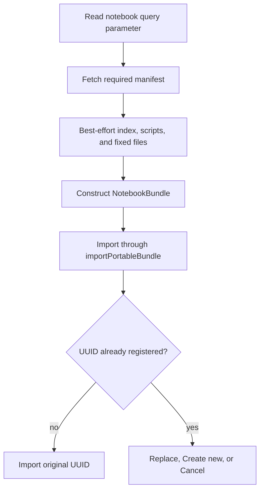

# GitHub Notebook Publishing

## Goal

Publish DashQL notebooks as ordinary, reviewable files on public GitHub Pages without requiring a
`.dashql` archive or a DashQL-hosted publishing service.

Authors keep the existing notebook folder as the source of truth:

```text
dashql-notebook.json
dashql-relations.sql
dashql-functions.sql
scripts/
  dashql-draft.sql
  1_main/
    1_query.sql
```

GitHub Pages serves these files with wildcard CORS, so `https://dashql.app` can fetch them directly.

## Derived Index

Static HTTP servers cannot enumerate `scripts/`. DashQL therefore maintains a generated
`dashql-notebook-index.json` next to the authoritative notebook files:

```json
{
  "folders": [
    {
      "name": "1_main",
      "scripts": [
        { "name": "1_query.sql" }
      ]
    }
  ]
}
```

The index contains names only. It does not duplicate notebook metadata, SQL content, sizes, hashes,
or timestamps. Array order follows DashQL's natural folder and script ordering and preserves empty
folders.

The index is derived, not authoritative:

- Local folder loading enumerates the filesystem.
- `.dashql` loading enumerates the ZIP central directory.
- Local writes regenerate the index when folder or script names change.
- Importing a folder or ZIP regenerates the index in the imported destination.
- Remote HTTP loading uses the index when available because the server cannot expose its directory
  tree. A missing or malformed index produces a metadata-only notebook.
- ZIP import ignores an index if one is present.
- ZIP export never includes the index.

Fixed optional files are discovered by convention and are not listed in the index:

- `dashql-relations.sql`
- `dashql-functions.sql`
- `scripts/dashql-draft.sql`

## Link And Loading Flow

A published link points DashQL at the authoritative manifest:

```text
https://dashql.app/?notebook=https%3A%2F%2Fowner.github.io%2Frepository%2Fexample%2Fdashql-notebook.json
```



The query parameter is consumed before asynchronous loading so a refresh does not repeat an import
or reopen a conflict dialog.

Remote loading accepts public HTTPS URLs ending in `dashql-notebook.json`. That manifest is the only
required resource. The index, every indexed script, catalog files, and the draft are optional. Missing
or malformed index entries and unavailable files are skipped, allowing stale generated indexes to
degrade gracefully. Index entries are names, not URLs: folder and script names may not contain
separators or traversal components, and all fetched files remain below the manifest's directory on
the same origin.

The downloaded tree becomes an editable local OPFS snapshot. Its metadata records `HTTP` provenance
and the original manifest URL. Later edits do not write back to GitHub Pages.

## UUID Collisions

Remote trees do not have a separate import implementation. After all remote files are read and
validated, the resulting `NotebookBundle` enters the same portable import path used by `.dashql`
files and inline ZIP links.

This preserves the existing behavior:

- No conflict: retain the published UUID.
- Create new: allocate a fresh UUID and append ` (copy)` to a non-empty name.
- Replace: stage and verify the complete replacement before mutating the registered notebook.
- Cancel: make no storage changes.

Both OPFS and registered native notebooks participate in the UUID check.

## Bundled DashQL Examples

The Bazel build stages the declared `examples/notebooks/` files under Vite's `publicDir`. Vite copies
that tree unchanged into Pages, Electron, and reloc builds at the same root-relative paths. The root
Bazel filegroup controls which files enter the staged public directory and excludes caches and
`.DS_Store` files:

```text
https://dashql.app/static/examples/notebooks/<name>/dashql-notebook.json
```

Local cache directories and `.DS_Store` files are excluded from the build. The example subtree uses
`Cache-Control: no-store, max-age=0` so every open requests its manifest, index, and SQL files again.
Application assets retain their existing cache policy.

`bundled_notebooks.ts` is the typed registry of root `dashql-notebook.json` paths. On the web those
paths resolve against the current HTTP origin; in the packaged app they resolve under
`app://bundle/static/examples/notebooks/`. The notebook files remain separate static resources rather than
being embedded into a JavaScript chunk.

Cloudflare Pages treats a deployment without a root `404.html` as an SPA. A directory-local
`static/404.html` ensures a missing optional notebook file returns a real 404 instead of the
application HTML.

## GitHub URL Forms

GitHub Pages:

```text
https://owner.github.io/repository/path/dashql-notebook.json
```

Raw GitHub also works, but the URL must include a branch, tag, or commit:

```text
https://raw.githubusercontent.com/owner/repository/main/path/dashql-notebook.json
```

Public GitHub Pages and Raw responses currently provide `Access-Control-Allow-Origin: *`. Requests
are simple credential-free `GET`s; DashQL does not send cookies, authorization, or custom headers.
