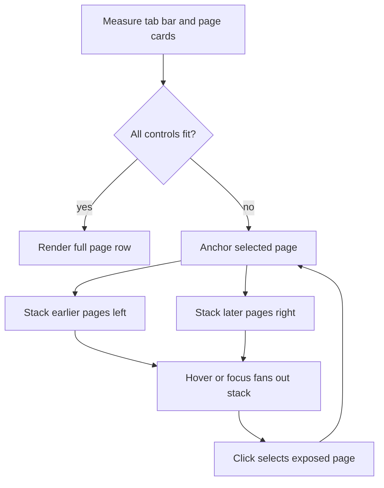

# WIP: Notebook page overflow

## Problem

The notebook tab bar combines two different groups:

- Draggable notebook page cards on the left.
- The add-page control and static catalog tabs (`relations` and `functions`) on the right.

Today all controls share one non-wrapping flex row. Page cards do not shrink, so a notebook with
many pages eventually overflows the available width and introduces a horizontal scrollbar. The
scrollbar consumes vertical space, separates the catalog controls from their intended fixed
position, and makes page navigation feel like scrolling a document rather than moving through a
small ordered collection.

The application already provides Previous Page and Next Page actions, plus `Ctrl+H` and `Ctrl+L`
keybindings. The tab bar therefore does not need to expose every page at full width at the same
time. It does need to preserve direct pointer access to every page and make the current page easy to
identify.

## Design summary

When all page cards fit, the tab bar retains its current horizontal presentation. When they do not
fit, it replaces scrolling with two overlapping card stacks around the selected page:

- Earlier pages collapse into a stack on the left.
- The selected page remains fully visible in the center.
- Later pages collapse into a stack on the right.
- Add Page, Relations, and Functions remain fixed and fully visible at the right edge.
- Hovering or focusing either stack fans out its cards within the available width.
- Hover and focus only reveal cards. Clicking a revealed card selects it.



## Layout

The tab bar is divided into two layout regions:

1. A flexible page-card viewport.
2. A fixed control group containing Add Page and, when connected, Relations and Functions.

The fixed group never participates in page-card compression. The page-card viewport uses its
remaining width to choose between the full-row and stacked presentations. It clips visual overflow
and never becomes horizontally scrollable.

The selected page is the anchor because it provides the most useful stable context while navigating.
Changing selection, whether by click, sidebar action, or keybinding, immediately promotes the new
selected page to the fully visible position. If a catalog tab is selected, the most recently selected
notebook page remains the page-stack anchor.

The stacking calculation is view-only. It must not reorder pages or persist layout metadata.

## Stack behavior

Collapsed cards overlap so that a narrow leading or trailing edge remains available for each page.
The exposed edges communicate page count and provide pointer targets without requiring a scrollbar.
Visual stacking order should make cards nearer the selected page appear above cards farther away.

Hovering a collapsed card or moving keyboard focus into a stack adaptively expands that stack:

- The focused or hovered card receives enough width to reveal its label when space allows.
- Sibling cards remain compressed into exposed edges.
- Expansion stays inside the page-card viewport and cannot cover the fixed controls.
- Moving between cards updates the expanded card without selecting a page.
- Leaving the stack restores the compact presentation.
- Clicking or activating a card selects it and makes it the new center anchor.

Transitions should be short and limited to layout properties such as transform and width. They must
be disabled when the user requests reduced motion.

## Navigation

Existing navigation remains authoritative:

- Previous Page and `Ctrl+H` move left through notebook pages.
- Next Page and `Ctrl+L` move right through notebook pages.
- Existing traversal into Relations and Functions remains unchanged.
- Clicking a collapsed or expanded card selects that page.
- Clicking the selected page retains the existing behavior of returning from details to the page
  feed.

The card stacks are a compact selection surface, not a new navigation model. They do not wrap page
selection at either end and do not select pages in response to hover alone.

## Drag and drop

When every page fits, page reordering behaves exactly as it does today.

When stacking is active, only the selected, fully visible page is draggable. Collapsed cards remain
clickable selection targets, but their drag listeners are disabled. A user first selects a collapsed
page and may then drag it from the center anchor. This avoids ambiguous drag geometry and accidental
reordering while traversing a dense stack.

Responsive layout changes must never dispatch `REORDER_PAGES`. The existing reducer and folder-prefix
renaming remain the only source of persistent page order.

## Accessibility

The overflow treatment must remain usable without a mouse:

- Stack expansion occurs on keyboard focus as well as pointer hover.
- Hover or focus does not change the selected page or open a different view.
- Every page card retains its accessible name, tab semantics, and selected state.
- Add Page, Relations, and Functions use semantic, keyboard-operable controls.
- A visible `:focus-visible` treatment is preserved throughout compact and expanded states.
- The visual transitions respect `prefers-reduced-motion`.
- Existing keyboard page navigation and dnd-kit keyboard reordering continue to work.

The existing drag-to-reorder interaction does not provide a single-pointer, non-dragging alternative
as required by WCAG 2.2 SC 2.5.7. Move Page Left and Move Page Right actions are a related follow-up;
they are not required to replace the overflow scrollbar.

## Implementation outline

The tab rendering should move into a focused `NotebookPageTabs` component while selection and catalog
state remain owned by `NotebookPage`.

The component needs:

- A resize observer for the flexible page-card viewport.
- Per-card natural-width measurements.
- A pure layout function that computes full-row or stacked positions from viewport width, ordered
  page ids, measured widths, selected id, and hovered/focused id.
- Stable mounting and logical DOM order for all page cards.
- CSS transforms, widths, and z-index values that realize the computed layout without scrolling.
- A fixed sibling container for Add Page and catalog tabs.

Keeping all cards mounted preserves tab semantics, direct selection, and drop targets. Responsive
visibility remains a presentation concern and does not alter notebook state.

## Test plan

Add focused coverage for:

- A full row when all controls fit.
- Left and right stacks around a selected middle page.
- First-page and last-page boundary layouts.
- Hover and focus expansion without selection.
- Selection of a collapsed card and promotion to the center anchor.
- Resize transitions between full-row and stacked modes.
- Fixed visibility of Add Page, Relations, and Functions.
- `Ctrl+H` and `Ctrl+L` selection changes while stacked.
- Drag enabled only for the selected page while stacked.
- No reorder dispatch caused by measurement or responsive layout.
- Reduced-motion styling.

Verification must use the repository's Bazel targets:

```sh
bazel test //packages/dashql-app:tsc_typecheck_test
bazel test //packages/dashql-app:test
bazel build //packages/dashql-app:pages
```

## Non-goals

- Persisting stack state, card widths, or responsive positions.
- Replacing Previous Page, Next Page, or their keybindings.
- Selecting or previewing notebook content on hover.
- Making collapsed cards directly draggable.
- Changing the persistent page ordering model.
- General redesign of the notebook header or catalog views.
