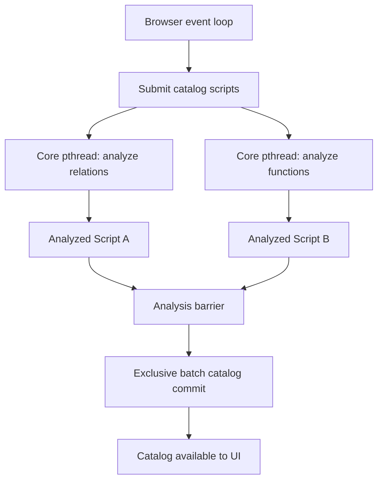

# Parallel Analyzer

## Status

Work in progress. This document proposes parallel catalog-script analysis in one shared, pthread-enabled DashQL Core WebAssembly module.

## Motivation

DashQL Core deliberately runs synchronously in the browser event loop. This is appropriate for interactive script processing: an editor transaction updates one script, analyzes it, moves the cursor, and may compute completion before the transaction completes.

Catalog loading has different constraints. Initial connection setup and catalog refresh can produce multiple independent scripts, most commonly a relation catalog and a function catalog. Analyzing these scripts sequentially blocks the browser event loop even though they can be prepared concurrently and published at one catalog synchronization point.

The goal is to move each complete, single-threaded `Script::Analyze()` call onto a Core pthread while retaining:

- One DashQL Core module and one shared WebAssembly heap.
- One shared catalog and the existing pointer-based object model.
- Synchronous analysis within an individual script.
- Synchronous editor analysis in the first implementation.
- One exclusive catalog commit after all required catalog analyses finish.

The design does not use independent workers with separate DashQL Core module instances. It also does not parallelize the analyzer passes within one script.

## Proposed Architecture



The analyzed scripts remain in shared WebAssembly memory. There is no serialized analyzer descriptor and no import step. Job completion establishes the happens-before relationship required for the controlling thread to read each script's parsed and analyzed state and commit it to the catalog.

## Concurrency Contract

| Resource | Contract |
|---|---|
| `Script` | Exclusively owned by one thread while queued or analyzing |
| Scanner, parser, and analyzer state | Per-script; no additional synchronization |
| `NameRegistry` and `StringPool` | Per-script; no thread-safety changes required |
| Catalog entries and indexes | Shared/read lock for the complete analysis |
| Script catalog-entry IDs | Atomic monotonic counter |
| Database and schema IDs | Canonical name reservation under a short mutex |
| Catalog load, update, drop, and clear | Exclusive catalog lock |
| Job completion | Release/acquire handoff before results are read |

The scanner, parser, and analyzer already construct invocation-local state. Distinct scripts own distinct scanned scripts, name registries, string pools, parsed scripts, analyzer passes, and timing statistics. These components do not require cross-script locking.

The browser thread must never synchronously wait for an analysis thread or a catalog write lock. It awaits job completion asynchronously and only enters the catalog commit after all readers in that batch have finished.

## Canonical ID Reservation

### Script Entry IDs

Script catalog-entry IDs only need to be unique. `next_entry_id` should become an atomic monotonic counter:

```cpp
CatalogEntryID Catalog::AllocateEntryId() {
    return next_entry_id.fetch_add(1, std::memory_order_relaxed);
}
```

Entry IDs are not reused during the lifetime of a catalog.

### Database and Schema IDs

Atomic counters alone do not provide canonical identity. Two concurrent analyses can safely allocate two different IDs for the same database name, but the second script will still fail catalog loading because one name must map to one ID.

The catalog therefore needs a persistent ID namespace separate from active catalog membership:

```cpp
std::mutex id_reservation_mutex;

std::unordered_map<std::string, CatalogDatabaseID>
    database_ids_by_name;

std::unordered_map<QualifiedSchemaName, CatalogSchemaID>
    schema_ids_by_name;

std::atomic<CatalogDatabaseID> next_database_id;
std::atomic<CatalogSchemaID> next_schema_id;
```

Reservation performs a short synchronized name lookup and allocates only when the name has not been seen before:

```cpp
CatalogDatabaseID Catalog::ReserveDatabaseId(std::string_view name) {
    std::lock_guard lock{id_reservation_mutex};

    if (auto iter = database_ids_by_name.find(name);
        iter != database_ids_by_name.end()) {
        return iter->second;
    }

    auto id = next_database_id.fetch_add(1, std::memory_order_relaxed);
    database_ids_by_name.emplace(std::string{name}, id);
    return id;
}
```

`ReserveSchemaId()` follows the same pattern using an owned `(database, schema)` key and verifies that an existing schema reservation belongs to the expected database ID.

Reservation properties:

- Concurrent references to the same name receive the same ID.
- Different names receive unique IDs.
- Reservation keys own their strings and do not borrow script memory.
- Reservations survive entry replacement and removal.
- Worker completion order does not determine whether a script can be committed.
- Existing `CATALOG_ID_OUT_OF_SYNC` checks remain as defensive validation.

Table and function IDs do not need global allocators. They derive from the script entry ID and the declaration's local ordinal.

## Catalog Read and Write Phases

Add a shared catalog state lock:

```cpp
mutable std::shared_mutex state_mutex;
```

Analysis acquires a shared lock around the complete operation:

```cpp
void Catalog::AnalyzeScript(Script& script, bool parse_if_outdated) {
    std::shared_lock lock{state_mutex};
    script.AnalyzeUnlocked(parse_if_outdated);
}
```

The lock must cover the entire analysis, not individual catalog lookups. Name resolution obtains references into catalog entries and continues using them after lookup functions return.

The following operations acquire the exclusive lock:

- `LoadScript`
- `UpdateScript`
- `DropScript`
- `Clear`
- Batch catalog replacement

The global lock order is:

```text
catalog state lock
then ID reservation mutex
```

Analysis takes the catalog shared lock and briefly takes the reservation mutex when it encounters database or schema declarations. A commit takes the catalog exclusive lock and may validate reservations using the same lock order.

## Script Isolation

An asynchronous analysis job holds an exclusive lease on its script:

```text
IDLE -> QUEUED -> ANALYZING -> READY -> IDLE
                          -> FAILED -> IDLE
```

While a script is queued, analyzing, or waiting for result consumption, callers cannot:

- Insert, erase, or replace text.
- Submit another analysis.
- Read parsed or analyzed buffers.
- Move its cursor or request completion.
- Format it.
- Destroy it.

The job retains the script, its catalog, and the DashQL module until the terminal result is consumed and the lease is released.

The worker publishes terminal state with release semantics. Polling or notification on the controlling thread observes it with acquire semantics before reading the ordinary, non-atomic fields in `Script`.

## Shared-Core Executor

Enable Emscripten pthreads for the existing Core module. Use a small, preallocated C++ executor pool rather than creating new DashQL module instances.

Initial executor configuration:

- Two persistent analysis threads.
- A shared job queue.
- One complete `Script::Analyze()` call per job.
- No nested parallelism within one analysis.
- No synchronous wait on the browser thread.
- Per-job exception storage.
- Queued cancellation and running-result discard.

Conceptual C ABI:

```cpp
uint32_t dashql_script_analyze_submit(
    Script* script,
    bool parse_if_outdated);

AnalyzeJobState dashql_analyze_job_poll(uint32_t job_id);

StatusCode dashql_analyze_job_error_code(uint32_t job_id);

void dashql_analyze_job_error_message(
    FFIResult* result,
    uint32_t job_id);

bool dashql_analyze_job_cancel(uint32_t job_id);

void dashql_analyze_job_release(uint32_t job_id);
```

The TypeScript API exposes:

```ts
await script.analyzeAsync();
```

Submission and polling must return immediately. Completion can use `Atomics.waitAsync` where available, with adaptive timer polling as a fallback.

The executor catches `dashql::Exception`, `std::exception`, and unknown exceptions inside the pthread. No exception may escape a persistent worker entry point. A queued job may be removed. A running job is not interrupted; cancellation marks its result as unwanted and releases it after analysis finishes.

## Emscripten Build

Update the Core WASM target to include:

- `-pthread`
- `-matomics`
- Existing `-mbulk-memory`
- `use_pthreads`
- `PTHREAD_POOL_SIZE=2`
- Strict pool preallocation
- `ALLOW_BLOCKING_ON_MAIN_THREAD=0`
- An explicit maximum shared memory
- `ENVIRONMENT='web,node,worker'`
- `PROXY_TO_PTHREAD=0`

The pthread runtime must share the existing module memory and catalog. The executor threads receive jobs that reference objects in that shared heap.

Retain a non-pthread Core build as a compatibility fallback for environments without:

- `SharedArrayBuffer`
- WebAssembly threads
- Cross-origin isolation

The fallback preserves existing synchronous behavior and API compatibility, but catalog analysis continues to block the event loop.

The Vite build must be checked to ensure that Emscripten's pthread self-loader and generated worker URLs remain valid after asset hashing and bundling. The existing Pages, development, and Electron loopback-server COOP/COEP headers must apply to all Core worker resources.

## Batch Catalog Commit

After every required script in a catalog batch finishes analysis, commit the scripts at one synchronization point:

```cpp
Catalog::LoadScripts(std::span<const RankedScript> scripts);
```

The operation acquires the exclusive catalog lock and:

1. Validates every script before modifying catalog indexes.
2. Verifies that every script belongs to the target catalog.
3. Verifies that every script has a completed analysis.
4. Verifies that database and schema IDs match canonical reservations.
5. Validates entry-ID collisions and ranks.
6. Stages active-membership and index changes.
7. Publishes all relation and function entries.
8. Increments the catalog generation once.
9. Leaves the previous catalog unchanged if validation fails.

Atomic batch publication prevents observers from seeing a new relation catalog paired with an old function catalog.

The first implementation may reuse parts of `LoadScript` and `UpdateScript`, but it must add complete prevalidation or rollback before claiming atomic batch semantics.

## Initial Integration Scope

Use asynchronous analysis for catalog-script paths:

- Startup catalog restoration.
- Information-schema catalog loading.
- PostgreSQL relation and function loading.
- Salesforce relation and function loading.
- Hyper catalog replacement and validation.
- Prefetched Hyper function loading.

Where relation and function scripts are both available:

```ts
await Promise.all([
    catalogRelationScript.analyzeAsync(),
    catalogFunctionScript.analyzeAsync(),
]);

catalog.loadScripts([
    [catalogRelationScript, relationRank],
    [catalogFunctionScript, functionRank],
]);
```

Network requests and catalog SQL generation remain asynchronous as they are today. A script's text is installed before submitting its analysis job.

The first phase does not change:

- CodeMirror's per-keystroke synchronous analysis.
- Cursor movement or completion.
- General notebook script analysis.
- Formatting.
- Unchanged-text reanalysis of an already loaded script.

## Loaded-Script Refresh

Catalog refresh normally calls `replaceText()` before analysis. The changed text causes Core to build new scanned and parsed state, making it suitable for worker execution while the old analyzed entry remains published.

Unchanged-text reanalysis of an already loaded script remains serialized initially. `Script::Analyze()` currently clears and repopulates analyzer metadata in the existing `ScannedScript::NameRegistry`. If the old and candidate analyses share that scanned script, the candidate analysis mutates metadata reachable from the published entry while holding what is otherwise intended to be a read lock.

A later phase can support this case through copy-on-write:

- Build a fresh scan, parse, and analysis candidate.
- Leave the published old analysis untouched.
- Swap the new analysis into the script during exclusive catalog commit.

## Reference Lifetime Hardening

Analysis results can retain references to tables, columns, and registered names in existing catalog entries. The shared lock keeps those references valid during analysis, but later catalog updates can invalidate them.

This is not expected to block the initial declaration-only catalog batch, but it must be addressed before enabling concurrent analysis for general notebook scripts. Candidate strategies are:

- Retain referenced catalog entries through shared ownership.
- Replace cross-entry references with copied names and stable IDs.
- Retire replaced entries by catalog generation until dependent analyses expire.
- Detect stale generations before packing, completion, or compilation and require reanalysis.

Generated catalog scripts should be validated to ensure they do not unexpectedly create cross-entry references before they are admitted to the parallel path.

## Testing

### Native Concurrency Tests

Add real concurrent tests covering:

- Two scripts declaring tables in the same database and schema.
- Both analyses receive identical canonical database and schema IDs.
- Both sequential or batch loads succeed.
- Different names never receive duplicate IDs.
- Concurrent script construction produces unique entry IDs.
- Repeated stress runs produce deterministic flattened catalogs.
- Scanner and parser output remains deterministic across threads.
- Exceptions remain isolated to their jobs.

Update the existing `ParallelDatabaseRegistration` and `ParallelSchemaRegistration` tests so successful canonical reservation replaces the current expected failure.

### Locking Tests

Verify that:

- Multiple analyses may hold the catalog read phase concurrently.
- A catalog writer cannot enter before analyses finish.
- New analyses cannot begin during an exclusive commit.
- Catalog generation remains stable throughout one analysis.
- A successful batch commit increments generation once.
- Failed batch validation preserves the previous catalog.

### WASM Integration Tests

Verify that:

- All scripts and catalogs share one WASM heap.
- Analysis executes on a pthread rather than the browser thread.
- Job submission never blocks the browser thread.
- Relation and function analyses overlap.
- Script and catalog destruction is deferred while jobs hold leases.
- Queued cancellation works.
- Running cancellation discards the result safely.
- Worker errors become rejected promises.
- Catalog commit occurs only after all required jobs complete.

## Benchmarking

Measure before and after:

- Browser main-thread long-task duration.
- Relation-script analysis time.
- Function-script analysis time.
- Sequential versus parallel wall time.
- Catalog commit time.
- WASM memory and per-thread stack overhead.
- Startup time across multiple notebooks.
- Contention in the canonical ID reservation mutex.
- CPU oversubscription while HyperDB is active.

Start with two Core pthreads. Increase the pool only if profiling demonstrates enough independent catalog work without harmful contention with HyperDB.

## Delivery Sequence

1. Introduce atomic script-entry allocation.
2. Introduce canonical database and schema reservation.
3. Convert the current parallel-registration failure tests into success tests.
4. Add real native multithreaded analyzer tests.
5. Add catalog shared/exclusive locking.
6. Add atomic batch catalog commit.
7. Add the C++ pthread executor and job ABI.
8. Enable the pthread Core WASM target.
9. Add script/catalog leases and `analyzeAsync()`.
10. Convert startup catalog restoration.
11. Convert live catalog refresh paths.
12. Add WASM integration tests and browser benchmarks.
13. Evaluate general notebook analysis only after the catalog path is stable.

## Summary

The proposed concurrency boundary is:

```text
one shared Core module
+ one script per analysis thread
+ atomic unique script IDs
+ short canonical database/schema reservation
+ shared catalog read phase
+ exclusive batch catalog commit
```

This design unblocks the browser during catalog analysis without introducing independent Core instances, serializing analyzer output, or making per-script name registries globally thread-safe.
