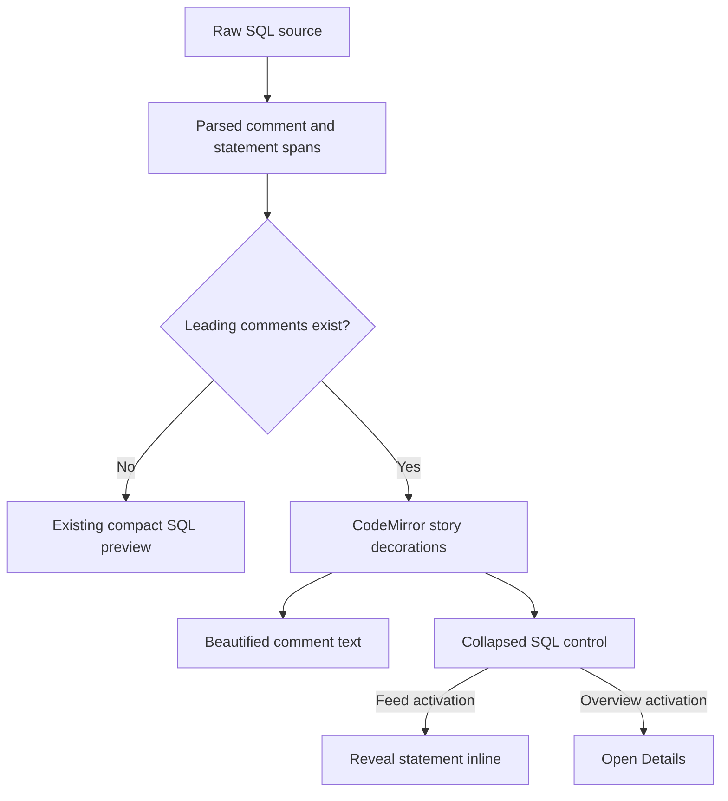

# Story Presentation for Notebook Feeds

## Goal

Make documented notebook entries quieter without adding a third dedicated feed mode. The existing vertical feed and zoomed-out overview should progressively present a script as a story when it has leading SQL comments:

- Preserve leading comments as normal SQL comments in the current editor theme.
- Collapse their associated SQL statement behind a small SQL control.
- Keep undocumented SQL visible rather than hiding code unexpectedly.
- Let the user expand SQL inline in the vertical feed.
- Open Details when the SQL control is activated in the fixed-size overview grid.

The SQL file remains the source of truth. Comments are user-authored input today and can later be generated or revised by an SLM.

## Product Decisions

- This is an extension of the existing `feed` and `overview` views, not a new view mode.
- Only leading comment blocks are story text.
- A leading block is a contiguous group of comments immediately preceding a statement, with only whitespace, blank lines, or statement separators between the block and the statement.
- Internal comments and trailing comments remain part of SQL and are not surfaced as narrative.
- Multi-statement scripts render one section per statement.
- A documented statement renders narrative plus a collapsed SQL control.
- An undocumented statement remains visibly rendered as compact SQL.
- Comment-only entries continue to use the normal compact preview.
- Comments keep their original delimiters, source formatting, and scanner-provided comment syntax highlighting. Markdown is not interpreted.
- Pending agent diffs and parse failures use the current compact SQL preview rather than story presentation, preserving existing diff/error behavior.



## Implementation Direction

Story presentation should be implemented inside the existing `ScriptPreview` CodeMirror surface, rather than through a separate React story-view component.

### Parser Associations

The parser already scans comments into `ParsedScript.comments`. Extend the parsed-statement representation so each statement carries enough source information to map its leading comments reliably:

```fbs
table Statement {
    statement_type: StatementType;
    root_node: uint32;
    nodes_begin: uint32;
    node_count: uint32;
    statement_span: TextSpan;
    description_begin: uint32;
    description_count: uint32;
}
```

`description_begin` and `description_count` index the ordered existing comment-span vector. This avoids duplicating comment locations while making the association available to every frontend consumer.

Association rules:

- Associate the maximal preceding comment block only when the intervening source contains no SQL tokens.
- Do not attach comments that follow SQL on the same line to the next statement.
- Do not attach comments contained inside a statement.
- Statement spans include their semicolon and internal/trailing comments, but exclude the next statement's leading comments.

Relevant code:

- `proto/fb/dashql/parsed_script.fbs`
- `packages/dashql-core/include/dashql/script.h`
- `packages/dashql-core/src/script.cc`
- `packages/dashql-core/src/parser/parse_context.cc`

### CodeMirror Extension

Add a dedicated decoration extension, tentatively `dashql_story_decorations.ts`, used by the read-only `ScriptPreview`.

The extension owns a state field such as:

```ts
interface StoryDecorationState {
    model: StoryModel | null;
    expandedStatements: ReadonlySet<number>;
    decorations: DecorationSet;
    atomicRanges: DecorationSet;
}
```

It is driven by two effects:

```ts
DashQLStoryUpdateEffect
DashQLStoryToggleStatementEffect
```

The story preview uses the raw source document so parsed offsets stay valid. It does not use the current compact formatter path, which changes source offsets and cannot safely support comment/statement replacements.

Decorations:

- A replacement decoration hides each collapsed documented statement.
- A `WidgetType` at the statement boundary renders the SQL control.
- When a statement is expanded, remove its replacement decoration and retain a control that can collapse it again.
- Expose replacement ranges through `EditorView.atomicRanges` so keyboard navigation treats collapsed SQL as an atomic unit.

Replacement decorations that span line breaks must be supplied directly by a `StateField` through `EditorView.decorations`, rather than a late view-derived decoration function, because they alter vertical layout.

### SQL Control

The widget uses a native button, not a clickable `div`:

- `type="button"`
- statement-specific accessible name
- `aria-expanded`
- `data-dashql-story-control` for event routing
- native Enter and Space support
- visible `:focus-visible` styling

The vertical feed dispatches `DashQLStoryToggleStatementEffect` to reveal or hide the source SQL inline. The existing feed-row `ResizeObserver` should then update the virtualized row height.

The overview configures the same extension with an activation callback that opens Details instead of expanding inline. Its fixed grid geometry remains unchanged.

### Preview Paths

`ScriptPreview` selects its behavior as follows:

| Condition | Preview behavior |
| --- | --- |
| No story comments | Existing compact formatted SQL preview |
| Leading story comments | Raw source with story decorations |
| Pending rewrite diff | Existing compact formatted diff preview |
| Scanner/parser errors | Existing compact SQL preview fallback |

The current scanner-highlight extension remains useful for expanded SQL. Story comment ranges should receive the narrative decorations at higher precedence than regular comment token coloring.

### Feed and Overview Integration

`ScriptCard` currently opens Details from a capture-phase pointer handler. It must ignore events originating under `[data-dashql-story-control]`, allowing the CodeMirror widget to toggle inline SQL first.

`OverviewCard` must similarly allow the SQL control to stop card click propagation and invoke its `onOpen` handler explicitly. Overview CSS currently suppresses preview pointer events; it needs a narrow exception for the SQL control.

Relevant code:

- `packages/dashql-app/src/view/notebook/notebook_script_preview.tsx`
- `packages/dashql-app/src/view/editor/dashql_decorations_standalone.ts`
- `packages/dashql-app/src/view/notebook/notebook_script_feed.tsx`
- `packages/dashql-app/src/view/notebook/overview_card.tsx`
- `packages/dashql-app/src/view/notebook/notebook_script_feed.module.css`
- `packages/dashql-app/src/view/notebook/notebook_page_overview.module.css`

## Test Plan

Parser coverage:

- Leading line-comment blocks.
- Leading block comments, including conventional `*` prefixes.
- Multiple statements with independent comment blocks.
- Blank lines between a comment block and SQL.
- Same-line trailing comments.
- Internal comments.
- Comment-only scripts.
- Statement span boundaries, including semicolons.

App and CodeMirror coverage:

- Comment delimiters are hidden while narrative text remains readable.
- Paragraph gaps are preserved.
- Documented SQL starts as an accessible collapsed control.
- Feed activation expands and collapses a statement.
- Multiple statements can expand independently.
- Undocumented statements remain visible.
- Comment-only scripts have no SQL control.
- Overview activation opens Details and does not resize the grid card.
- Pending diffs and parse errors retain their existing preview behavior.
- Collapsed statement replacements are atomic for keyboard navigation.

## Verification

Use Bazel only:

```bash
bazel run //snapshots/parser:update
bazel test //packages/dashql-core:parser_tests
bazel test //packages/dashql-app:tsc_typecheck_test
bazel test //packages/dashql-app:test
bazel test //packages/dashql-core:all //packages/dashql-app:all
```
